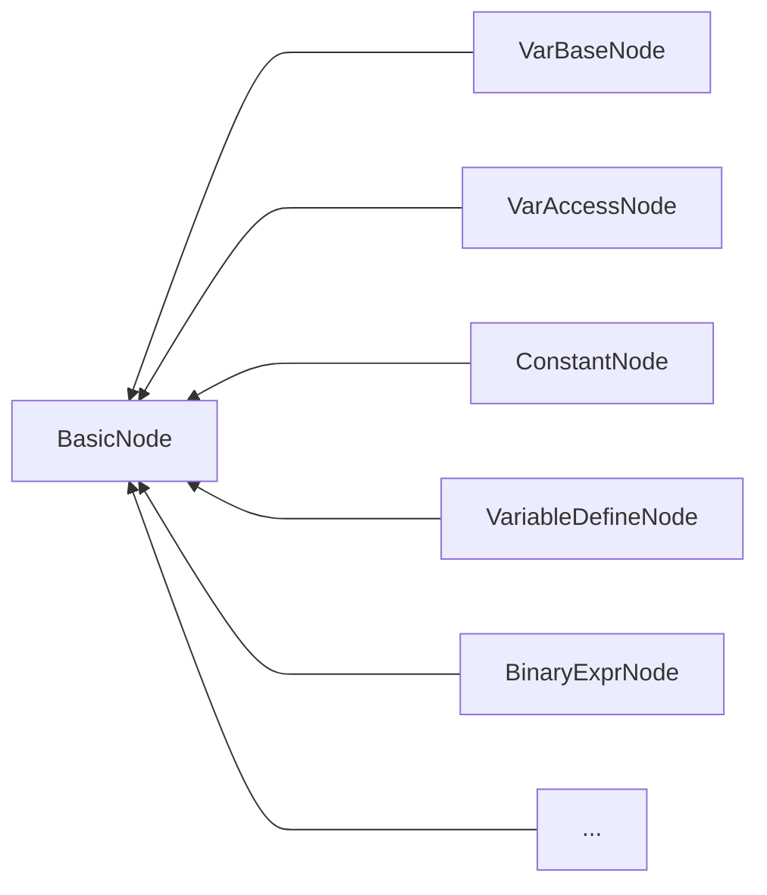
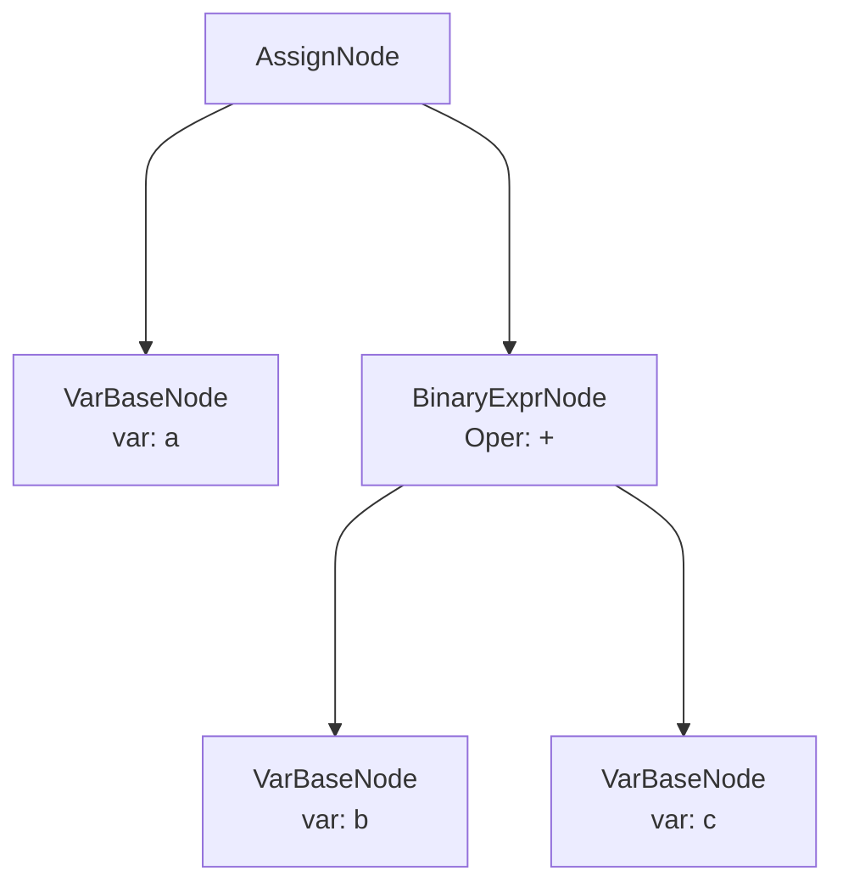
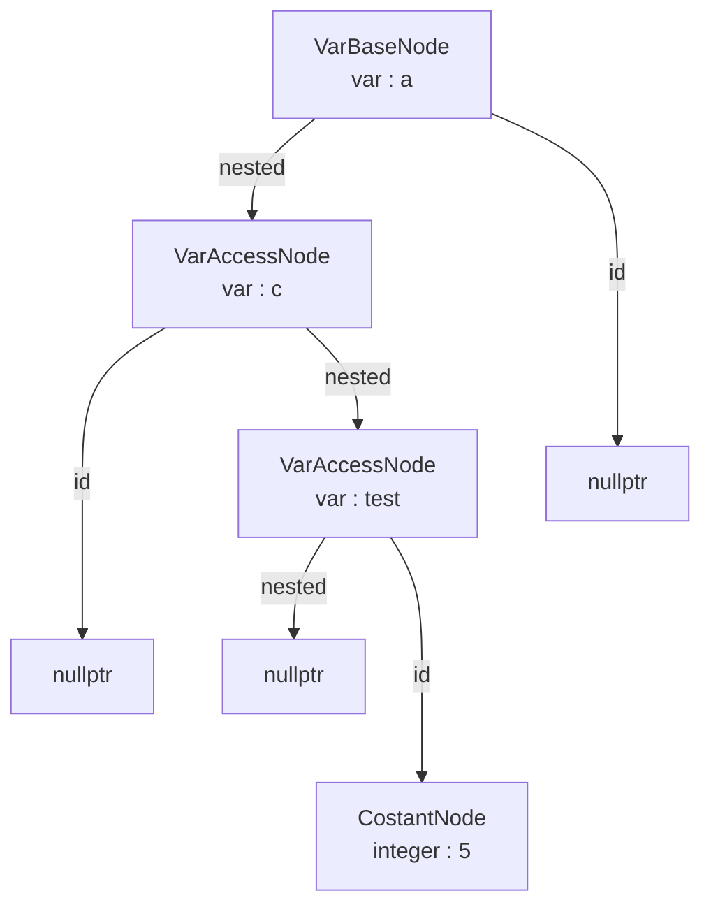
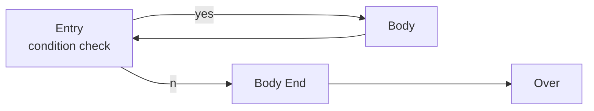
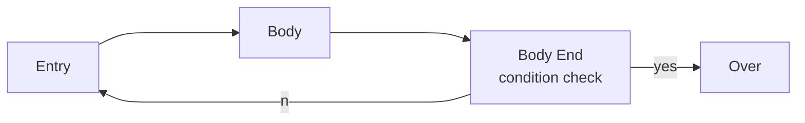
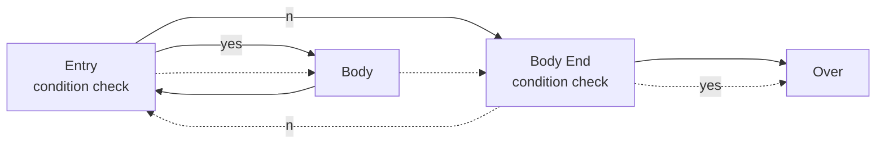
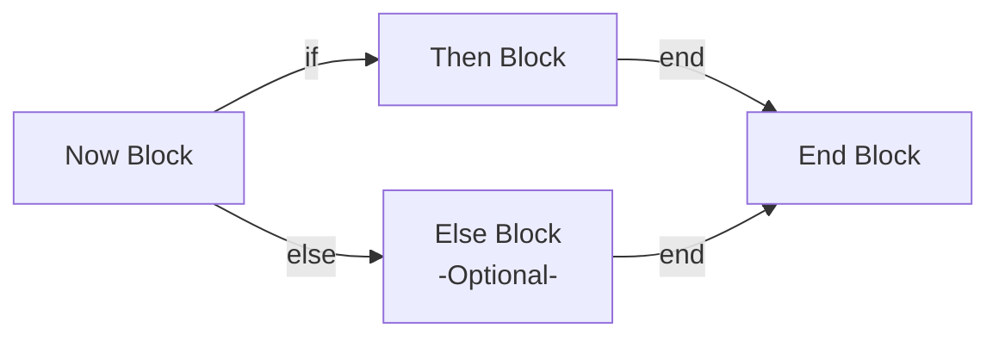

# Report

Jiang Haohan, 3180101995, Computer Science & Technology

Wang Xulong, 3180105260, Computer Science & Technology

#### Abstract

In the Compile Principle course, we learn about the Basic method to generate a Compiler.

The final Project is to make a simple compiler of the SPL, which is reduced from the Pascal.

In this project, we use the Flex, Bison and LLVM to get tokens, build the syntax tree and build the IR codes and assembly code respectively.

Our development language is C++. The build environment is Windows Subsystem for Linux.

### 1 Introduction

This project, we use the flex, bison and LLVM to generate the code. LLVM use the IR code to divide the frontend and the backend, so that it's easily for us to construct a new compiler and no need to consider the backend and the target machine, so that it's a convenient tool to complete this project.

We divide the compiler into three parts: Lexical Analysis, Syntax Analysis and Sematic Analysis & Code Generation. In the first parts, we use the flex, which is called "Fast Lexical Analyzer Generator" for token reading. And we use Bison, which is compatible with the YACC, which is also based on the LALR(1) to generate the syntax tree. In the last part, we use the LLVM to generate the IR code to the assembly code and executing program.

### 2 Lexical Analysis

In this section, I will explain how our lexical analyzer will work. Based on the given SPL grammar rules, we modified some inadequate parts to make it more reasonable.

We use flex in Linux or win_flex in Windows to build lexer. 

#### 2.1 Key Words

Key words are those who has the highest priority to be detected.

This is the key word list :

 ```
 and array begin case const div do downto else end for function goto if mod MOD not NOT of or packed procedure program record repeat then to type until var while false FALSE maxint MAXINT true TRUE abs chr odd ord pred sqr sqrt succ write writeln boolean char integer real read
 ```

There are some changes to the original grammar document:

1. We changed "mod" to "mod" | "MOD" | "%"
2. We changed "not" to "not" | "NOT"
3. We changed "false" to "false" | "FALSE"
4. We changed "maxint" to "maxint" | "MAXINT"
5. We changed "true" to "true" | "TRUE"
6. We use "div" to represent integer division (or floor division) , e.g. 3 div 2 -> 1
7. All key words are strictly in their lowercase form or uppercase form. e.g. and √ And ×

#### 2.2 Symbols & Calculators

These are those at the second highest priority.

The symbols and calculator is marked as the tokens below:

```
( ) : LP RP
[ ] : LB RB
.. : DOTDOT
. : DOT
, : COMMA
+ - * / : PLUS MINUS MUL DIV
<> = : UNEQUAL EQUAL
>= > <= < : GE GT LE LT
:= : ASSIGN
: : COLON
; : SEMI
% : MOD
```

#### 2.3 Delimiters

We use **" " | "\n" | "\t"** to represent delimiters, in these cases, we don't return any values because we just need delimiters to split the tokens, we don't need to take them into consideration in the syntax analysis part.

#### 2.4 Other Issues

There are constants and identifiers to be detected.

We don't support strings, thus we only need to detect float numbers, integers and characters.

```
[0-9]*\.[0-9]+([eE][-+]?[0-9]+)? : float numbers
[0-9]+ : integers
"'"[A-Za-z]"'" : characters
[a-zA-Z][_a-zA-Z0-9]* : identifiers
. : others
```

here the priority of the identifiers is lower than those key words, thus the lexer won't take the key words as identifiers.

We consider the negative symbol “-” in the syntax analysis part, so we don't need to consider it here.


### 3 Syntax Analysis

We majorly use the original rule from the SPL document. But we modified some of the parts which didn't seemed to be reasonable enough. 

#### 3.1 Program Structure

The rules of the whole program structure is as below:

```
program -> program_head routine DOT
program_head -> PROGRAM ID SEMI
routine -> routine_head routine_body
sun_routine -> routine_head routine_body
routine_head -> const_part type_part var_part routine_part

const_part -> CONST const_expr_list | epsilon
const_expr_list -> const_expr_list const_expr | const_expr
const_expr -> ID EQUAL const_value SEMI
const_value -> const_int_value | const_double_value | const_char_value | const_bool_value

type_part -> TYPE type_decl_list | epsilon
type_decl_list : type_decl_list type_definition | type_definition
type_definition : ID EQUAL type_decl SEMI

var_part  : VAR var_decl_list | epsilon
var_decl_list : var_decl_list var_decl | var_decl
var_decl : name_list COLON type_decl SEMI
name_list : name_list COMMA ID | ID

routine_part : routine_part function_decl | routine_part procedure_decl | epsilon
function_decl : FUNCTION ID parameters COLON simple_type_decl SEMI sub_routine SEMI
procedure_decl : PROCEDURE ID parameters SEMI sub_routine SEMI
parameters : LP para_decl_list RP | epsilon
para_decl_list : para_decl_list SEMI para_type_list | para_type_list
para_type_list : VAR name_list COLON simple_type_decl | name_list COLON simple_type_decl

routine_body : compound_stmt
compound_stmt : BEGIN stmt_list END
```

The whole program include a program name (ID in program_head) and a routine 

In each routine, the routine head include 4 parts(we eliminate the label part) : the const_part which defines some constant values, the type_part which defines user-define types, the var_part which defines variables and the routine_part which defines functions and procedures.

The routine body is just the main function, it is covered by a BEGIN-END pair, including a statement list.

Const_value includes integers, floating numbers, characters and bool constants(true & false)

We merge the function_head into the function_decl in the origin rule

type declarations : 

```
simple_type_decl : SYS_TYPE 
| ID (user-defined type)
| LP name_list RP (enum type)
| const_value DOTDOT const_value (range)
| MINUS const_value DOTDOT const_value (range)
| MINUS const_value DOTDOT MINUS const_value (range)
| ID DOTDOT ID (range)
array_type_decl : ARRAY LB simple_type_decl RB OF type_decl
record_type_decl : RECORD field_decl_list END
field_decl_list : field_decl_list field_decl | field_decl
field_decl : name_list COLON type_decl SEMI
```

Here we define all types form in the SPL language. Simple type declaration include basic types and range types(use for array). Array and record type declaration defined array and record(just like struct in C) types. 

#### 3.2 Statements

In SPL Language, we have nine kinds of statements:

```
stmt_list : stmt_list stmt SEMI | epsilon
stmt : INT_VAL COLON non_label_stmt | non_label_stmt
non_label_stmt : assign_stmt | proc_stmt | compound_stmt | if_stmt | repeat_stmt | while_stmt | for_stmt | case_stmt | goto_stmt

assign_stmt : ID ASSIGN exxpression | ID LB expression RB ASSIGN expression(array) | ID DOT ID ASSIGN expression(record member)
proc_stmt : ID | ID LP expression_list RP | SYS_PROC LP expression_list RP | READ LP factor RP
if_stmt : IF expression THEN stmt else_clause
else_clause : ELSE stmt | epsilon
repeat_stmt : REPEAT stmt_list UNTIL expression
while_stmt : WHILE expression DO stmt
for_stmt : FOR ID ASSIGN expression direction expression DO stmt
direction : TO | DOWNTO
case_stmt : CASE expresson OF case_expr_list END
case_expr_list : case_expr_list case_expr | case_expr
case_expr : const_value COLON stmt SEMI | ID COLON stmt SEMI
goto_stmt : GOTO INT_VAL
```

Most of these grammar is same as C language, thus we don't need much more explanation.

#### 3.3 Expressions

In SPL language, we need to split the expression into different hierarchy to meet the different priority of binary calculations:

```
expression : expression GE expr | expression GT expr | expression LE expr | expression LT expr | expression EQUAL expr | expression UNEUQAL expr | expr
expr : expr PLUS term | expr MINUS term | expr OR term | term
term : term MUL factor | term DIV factor | term INT_DIV factor | term MOD factor | term AND factor | factor 
factor : ID | ID LP expression_list RP (calling function) | const_value | LP expression RP | NOT factor | MINUS factor | ID LB expression RB (array member) | ID DOT ID (class member)
```


#### 3.4 AST Construction & Transferring

For the convenient use of bison, we build our AST Tree based on the grammar rule at a concrete level, then transfer it to an abstract level(which will introduce in 4.4).

The concrete version of AST is as below:

```c++
	class ASTNode;
	class ProgramASTN;
	class ProgramHeadASTN;
	class NameASTN;
	class RoutineASTN;
	class RoutineHeadASTN;
	class ConstPartASTN;
	class TypePartASTN;
	class VarPartASTN;
	class RoutinePartASTN;
	class ConstExprASTN;
	class ConstValueASTN;
	class TypeDefASTN;
	class TypeDeclASTN;
	class FieldListASTN;
	class FieldDeclASTN;
	class NameListASTN;
	class VarDeclASTN;
	class FuncDeclASTN;
	class ProcDeclASTN;
	class ParaASTN;
	class ParaTypeListASTN;
	class StmtListASTN;
	class StmtASTN;
	class AssignStmtASTN;
	class ProcStmtASTN;
	class IfStmtASTN;
	class RepeatStmtASTN;
	class WhileStmtASTN;
	class ForStmtASTN;
	class CaseStmtASTN;
	class GotoStmtASTN;
	class ExprASTN;
	class ExprListASTN;
	class FactorASTN;
	class ElseASTN;
	class CaseExprASTN;
	class SExprASTN;
	class TermASTN;
```

As we can see, it's mostly based on the grammar rule, for each token we have an ASTN to represent it.

The whole ASTN is complicated, we just take three of the nodes as example and introduce how we transfer it into an abstract AST.

##### 3.4.1 Transferring ConstExprASTN

The structure of ConstExprASTN is like below:

```c++
	// const_expr -> NAME (EQUAL) const_value (SEMI)
	class ConstExprASTN : public ASTNode {
		std::string _name;
		ConstValueASTN* _constValueASTN;
	public:
		ConstExprASTN(std::string name, ConstValueASTN* constValueASTN);
		std::string getName() const;
		ConstValueASTN* getConstValueASTN() const;
	};
```

Here we transfer constexprASTN, it contains a name and a constant value ASTN , and it means to assign a constant value.

```c++
void ASTTransfer::TransferConstExprASTN(SPLAST::ConstExprASTN * astn)
{
	printfTransferMsg("ConstExprASTN", true);
	std::string name = astn->getName();
	SPLVarType type = astn->getConstValueASTN()->getType();
	std::shared_ptr<ASTNodes::VariableDefineNode> varDef(new ASTNodes::VariableDefineNode("ERROR",false,0,name));
	if (type == _INT) varDef->type = INT_TYPE;
	if (type == _BOOL) varDef->type = BOOL_TYPE;
	if (type == _CHAR) varDef->type = CHAR_TYPE;
	if (type == _DOUBLE) varDef->type = DOUBLE_TYPE;
	_vecptr->push_back(std::dynamic_pointer_cast<ASTNodes::BasicNode>(varDef));
	printfSize(this);

	std::shared_ptr<ASTNodes::AssignNode> varAss(new ASTNodes::AssignNode());
	std::shared_ptr<ASTNodes::VarBaseNode> lhs(new ASTNodes::VarBaseNode(name, nullptr, nullptr));
	varAss->LHS = lhs;
	varAss->RHS = std::dynamic_pointer_cast<ASTNodes::BasicNode>(TransferConstValueASTN(astn->getConstValueASTN()));
	_vecptr->push_back(std::dynamic_pointer_cast<ASTNodes::BasicNode>(varAss));
	printfSize(this);
	printfTransferMsg("ConstExprASTN", false);
	return;
}
```

Thus we construct a new AssignNode and a VarBaseNode to represent the variable name and the value of the node. and we get the type and value of the original node through `astn->getType() ` and `astn->getValue()` . After that we get a `void*` value and a `string` name. We store it into the AssignNode and VarbaseNode then print the success message.

##### 3.4.2 Transferring TypePartASTN

TypePartASTN is a representative node that has a sequence of node pointer stored in a vector.

The structure of TypePartASTN is as below:

```c++
	// type_part -> (TYPE) type_decl_list | %empty
	// type_decl_list -> {type_definition}*
	class TypePartASTN : public ASTNode {
		std::vector<TypeDefASTN*> _typeDefList;
	public:
		TypePartASTN();
		TypePartASTN(TypePartASTN* typePartASTN);
		TypePartASTN(TypeDefASTN* typeDefASTN);
		TypePartASTN(TypePartASTN* typePartASTN, TypeDefASTN* typeDefASTN);
		size_t getTypeDefNum() const;
		std::vector<TypeDefASTN*> getTypeDefList() const;
		TypeDefASTN* getTypeDef(size_t idx) const;
	};
```

Then we transfer it by transferring each of its child and push them into `_vecptr` (the pointer to the abstract BasicNode pointer which we need to insert the nodes)

```c++
void ASTTransfer::TransferTypePartASTN(SPLAST::TypePartASTN * astn)
{
	printfTransferMsg("TypePartASTN", true);
	size_t defNum = astn->getTypeDefNum();
	if (defNum == 0) {
		printfTransferMsg("TypePartASTN", false);
		return;
	}
	for (int i = 0; i <= defNum - 1; i++)
		TransferTypeDefASTN(astn->getTypeDef(i));
	printfTransferMsg("TypePartASTN", false);
	return;
}
```

##### 3.4.3 Transferring FactorASTN

The structure of FactorASTN can represent a series of AST nodes that consists of lots of exact data.

The structure of FactorASTN is as below:

```c++
	// factor -> NAME  (fType : _USERVAL) 
	// factor -> NAME (LP) expression_list (RP) (fType : _RET)
	// factor -> SYS_FUNCT (fType : _SYSFUNCT)
	// factor -> SYS_FUNCT (LP) expression_list (RP) (fType : _RET)
	// factor -> const_value (fType : _CONST)
	// factor -> (LP) expression (RP) (fType : _EXPR)
	// factor -> NOT factor (fType : _NOT)
	// factor -> MINUS factor (fType : _NEG)
	// factor -> ID (LB) expression (RB) (fType : _INDEX)
	// factor -> ID (DOT) ID (fType : _MEMBER)
	class FactorASTN : public ASTNode {
		SPLVarType _type;
		SPLFuncType _funcType = _ERRORFUNC;
		SPLFactorType _factorType;
		std::string _name;
		ExprListASTN* _argsList = nullptr;
		ConstValueASTN* _constVal;
		ExprASTN* _expr;
		std::string _memName;
		FactorASTN* _factor;
	public:
		FactorASTN(std::string name);
		FactorASTN(std::string name, ExprListASTN* argsList);
		FactorASTN(SPLFuncType funcType);
		FactorASTN(SPLFuncType funcType, ExprListASTN* argsList);
		FactorASTN(ConstValueASTN* constVal);
		FactorASTN(ExprASTN* expr);
		FactorASTN(FactorASTN* factor, SPLFactorType factorType);
		FactorASTN(NameASTN* name, ExprASTN* idx);
		FactorASTN(NameASTN* name, NameASTN* memName);
		SPLVarType getType() const;
		SPLFuncType getFuncType() const;
		SPLFactorType getFactorType() const;
		std::string getName() const;
		ExprListASTN* getArgsList() const;
		ConstValueASTN* getConstVal() const;
		ExprASTN* getExpr() const;
		std::string getMemName() const;
		FactorASTN* getFactor() const;
	};
```

Factor is transfer through the exact type of this factor(stored in _factorType, it splits constants, class members, function call nodes, etc.). We use a switch-case statement to found the exact type and construct corresponding node.

```c++
std::shared_ptr<ASTNodes::BasicNode> ASTTransfer::TransferFactorASTN(SPLAST::FactorASTN * astn)
{
	printfTransferMsg("FactorASTN", true);
	std::shared_ptr<ASTNodes::BasicNode> ptr;
	std::shared_ptr<ASTNodes::VarBaseNode> varbase;
	std::shared_ptr<ASTNodes::FunctionCallNode> funptr;
	std::shared_ptr<ASTNodes::BinaryExprNode> binary;
	std::shared_ptr<ASTNodes::VarAccessNode> varacc;
	switch (astn->getFactorType()) {
	case _USERVAL:
		ptr = std::dynamic_pointer_cast<ASTNodes::BasicNode>(std::shared_ptr<ASTNodes::VarBaseNode>(new ASTNodes::VarBaseNode(astn->getName(), nullptr, nullptr)));
		printfTransferMsg("FactorASTN", false);
		return ptr;
	case _SYSFUNCT:
		std::cout << "Error Factor type! Err = " << astn->getFactorType() << std::endl;
		printfTransferMsg("FactorASTN", false);
		return nullptr;
	case _RET:
		if (astn->getFuncType() != _USERFUNC) {
			std::cout << "Error Factor Funtion type! Err = " << astn->getFuncType() << std::endl;
			return nullptr;
		}
		ptr = _nodeptr;
		funptr = std::shared_ptr<ASTNodes::FunctionCallNode>(new ASTNodes::FunctionCallNode());
		_nodeptr = std::dynamic_pointer_cast<ASTNodes::BasicNode>(funptr);
		TransferExprListASTN(astn->getArgsList());
		_nodeptr = ptr;
		funptr->func_name = astn->getName();
		printfTransferMsg("FactorASTN", false);
		return std::dynamic_pointer_cast<ASTNodes::BasicNode>(funptr);
	case _CONST:
		printfTransferMsg("FactorASTN", false);
		return std::dynamic_pointer_cast<ASTNodes::BasicNode>(TransferConstValueASTN(astn->getConstVal()));
	case _EXPR:
		printfTransferMsg("FactorASTN", false);
		return TransferExprASTN(astn->getExpr());
	case _NOT:
		// limited function
		std::cout << "NOT instruction not finished yet.\n";
		printfTransferMsg("FactorASTN", false);
		return nullptr;
	case _NEG:
		binary = std::shared_ptr<ASTNodes::BinaryExprNode>(new ASTNodes::BinaryExprNode());
		binary->expr_op = BinaryOper::MINUS;
		binary->RHS = TransferFactorASTN(astn->getFactor());
		binary->LHS = std::dynamic_pointer_cast<ASTNodes::BasicNode>(TransferConstValueASTN(new SPLAST::ConstValueASTN(0)));
		printfTransferMsg("FactorASTN", false);
		return std::dynamic_pointer_cast<ASTNodes::BasicNode>(binary);
	case _INDEX:
		varbase = std::shared_ptr<ASTNodes::VarBaseNode>(new ASTNodes::VarBaseNode(astn->getName(), TransferExprASTN(astn->getExpr()), nullptr));
		printfTransferMsg("FactorASTN", false);
		return std::dynamic_pointer_cast<ASTNodes::BasicNode>(varbase);
	case _MEMBER:
		varacc = std::shared_ptr<ASTNodes::VarAccessNode>(new ASTNodes::VarAccessNode());
		varacc->nested_var = nullptr;
		varacc->var_name = astn->getName();
		varacc->idx = nullptr;
		varbase = std::shared_ptr<ASTNodes::VarBaseNode>(new ASTNodes::VarBaseNode(astn->getMemName(), nullptr, varacc));
		printfTransferMsg("FactorASTN", false);
		return std::dynamic_pointer_cast<ASTNodes::BasicNode>(varbase);
	case _ERRORFACTOR:
	default:
		std::cout << "Error Factor type! Err = " << astn->getFactorType() << std::endl;
		printfTransferMsg("FactorASTN", false);
		return nullptr;
	}
	printfTransferMsg("FactorASTN", false);
	return nullptr;
}
```


#### 3.5 Outputting AST

In `GraphGenerator.h` and `GraphGenerator.cpp` , we provide a way to output the whole AST. We visit each node just like in the AST Transferring part, and mark their recent level, finally output the message we want.

The core of the function is println():

```c++
void Visitor::println(std::string msg, bool isHead, std::ostream & os)
{
	if (_level == 0)
	{
		os << msg << std::endl;
		return;
	}
	if (_level == 1)
	{
		os << "|";
		if (isHead) os << HEAD;
		else os << NONHEAD;
		os << msg << std::endl;
		return;
	}
	for (size_t i = 0; i <= _level - 2; i++)
	{
		if (_isLastChild.at(i)) os << " ";
		else os << "|";
		os << NONHEAD;
	}
	if (_isLastChild.at(_level - 1) && !isHead) os << " ";
	else if(isHead) os << "|";
	else os << "|";
	if (isHead) os << HEAD;
	else os << NONHEAD;
	os << msg << std::endl;
	return;
}
```

 

### 4 Semantic Analysis & Code Generation

In this section, I'm going to introduce the Sematic Analysis, which includes the symbol table and the type check. At the same time, we also generate the IR code. In this part, we need to maintain some symbol tables so that make sure that there is no wrong in the code.

#### 4.1 Symbol Table

When it comes to symbol tables, we take the record, variable into consideration.

##### 4.1.1 Record Type Table

For the record, we need to note down the name of the record, and we can use the name of the record as a new variable type conveniently. We use the data structure below to maintain the information of all the record.

```c++
std::map<Type*, std::vector<Type*> > record_type_list;// StructType -> Member_Type_List
std::map<Type*, std::vector<std::string> > record_member_name_list;// StructType -> Member_Name_List
std::map<Type*, std::vector<bool> > record_member_array;// StructType -> Member_Name_List
```

We use the pointer to Type as the index to get the information of the record. use this pointer, we can get the member list of the record easily, and know whether the member is array or not. What's more, we can get the type list. As a result, when we meet a record type, we can recursively access it's member.

Surely, there is a condition that record type which is nested exists. To deal with this, we build others to maintain the information.

```c++
std::map<std::string, Type*> type_map;// TypeName -> Type Pointer
std::map<Type*, std::string> name_map;// Type -> TypeName Pointer
```

we can use the type name, which is shown as a string, to search the type pointer. After that, we can access the details of the record through the type pointer. To make the logic same as the native type, at the beginning of the program, I insert the native information to the table.

```c++
type_map["char"] = ByteType;
name_map[ByteType] = "char";
zero_initial[ByteType] = ConstantInt::get(ByteType, 0);
type_map["integer"] = IntType;
name_map[IntType] = "integer";
zero_initial[IntType] = ConstantInt::get(IntType, 0);
type_map["real"] = RealType;
name_map[RealType] = "real";
zero_initial[RealType] = ConstantFP::get(RealType, 0);
type_map["bool"] = BoolType;
name_map[BoolType] = "bool";
zero_initial[BoolType] = ConstantInt::get(BoolType, 0);
type_map["void"] = VoidType;
name_map[VoidType] = "void";
```

So that, we can use the record as the native type, which means it can deal with the nest type conveniently. The same logic make the access much more easily.

##### 4.1.2 Variable Table

After discussing the record type, we are going to discuss about the design of the variable table. As we discuss above, we treat the record type as one of the type which is similar to native type. there is no need to consider the record anymore. What we only need to pay attention to is the local variable and global variable.

We use the new data structure to maintain the information of the different level's variable.

```c++
int stage;
std::map<std::string, Value*> table_mem[MAX_NESTED];// VarName -> Memory
std::map<std::string, Type*> table_type[MAX_NESTED];// VarName -> Type
std::map<std::string, bool> table_array[MAX_NESTED];// VarName -> Array
```

In these vectors, I store the links of the variable's name and the memory pointer, and the type, whether is array or not. Each time, when we need the information, we can use the map directly and get the information. I use the index of the vector array to show the region of the variable. If the index is 0, it involve the global variable. When the index is bigger than 0, it means the local variable.

When we enter a region which may have the local variables, we need to increase the value of the stage, so that, we can create a new table for the local variables. And we don't check the re-definition of the variable which is at different level, but access the low level variables. 

When we access the variable, we need to check the set level by level from stage down to 0(global variable table). After that, if we can't find the variable, it throws a error at the semantic analysis.

#### 4.2 Type Check & Cast

During the program executing, we may meet the condition that operators are different types. To deal with that, we need to take care of the type of the operators, and sometimes it not easy for Intermediate Language(IR) because we can't calculating with two different-type-operators. There are two main issues: type check whether it can execute, if not give the wrong message, and type cast, if it can execute but need an explicit or implicit casting.

##### 4.2.1 Type check

First, let's take the type check into consideration. The four type we need to deal with has a obvious relationship that real > integer > char > bool. As a result, we use this rules as the basic rules when we do the type check.

when it comes to and/or, the only right condition is that both sides are bool type.

```c++
if (now_op == AND || now_op == OR){
        if ( (!check_bool(lv->getType())) || (!check_bool(rv->getType())) )
            throw new IRBuilderMeesage("[IRBuilder] Error : AND/OR's Bboth Sides Should be Bool Type");
}
```

When it comes to div/mod, which is only applied to the integer, we also need to check the both type, if there is a contradiction.

```c++
lcm_type = get_lcm_type(lv->getType(), rv->getType());
if (lcm_type == RealType && (now_op==DIV||now_op==MOD) ){
    throw new IRBuilderMeesage("[IRBuilder] Error : DIV/MOS's Bboth Sides Shouldn't be Real Type");
}
```

In the code blocks above, the variable `lcm_type` shows the type which can express the both types without trunk but extension.

If we calculate the binary expression with bool or char, we need to change it to the integer to calculate.

```c++
if (lcm_type == BoolType || lcm_type == CharType){
    lcm_type = IntType;
}
```

After the check, we need to convert it to the aim type and do the calculation, which we are going to discuss below.

##### 4.2.2 Type Cast

when we talk about the type cast. It's need a lot of patience. We regard the bool, char as unsigned type, but integer, real as signed type. So we use the signed extend, unsigned extend correspondingly.

```c++
Value* type_cast(Value* v, Type* dt){
    Type* vt = v->getType();
    if (vt == dt){
        return v;
    } else {
        if (dt == RealType){
            if (vt==BoolType || vt == CharType){
                return builder.CreateUIToFP(v, RealType);
            } else { // IntType -> RealType
                return builder.CreateSIToFP(v, RealType);
            }
        } else if (dt == IntType){
            return builder.CreateZExt(v, IntType);
        } else if (dt == CharType){
            return builder.CreateZExt(v, IntType);
        } else {
            throw new IRBuilderMeesage("[IRBuilder] Error : Type Wrong");
        }
    }
    throw new IRBuilderMeesage("[IRBuilder] Error : Type Wrong");
}
```

When we need to convert the the bool and char, we need use unsigned extension. When it comes to integer, we need signed convert.

However, in the assign operation, we need to cast the type to the aim type as before. however, this time, we need to deal with the trunk and extend two conditions.

```c++
Value* assign_cast(Value* v, Type* dt){
    Type* vt = v->getType();
    if (vt == dt) return v;
    if (dt == BoolType){
        if (vt == RealType){
            throw new IRBuilderMeesage("[IRBuilder] Error : Type Wrong");
        } else if (vt == IntType){
            return builder.CreateICmpNE(v, ConstantInt::get(IntType, 0));
        } else if (vt == CharType){
            return builder.CreateICmpNE(v, ConstantInt::get(CharType, 0));
        } else throw new IRBuilderMeesage("[IRBuilder] Error : Type Wrong");
    } ...
}
```

When we are converting to the bool type, we use comparison with zero, and trunk and extension when faced other types.

#### 4.3 IR Code for LLVM

In the IR code generation, we use the LLVM backend to generate the target assembly code. so that we need to transform the abstract AST to IR code for LLVM .

LLVM IR Code is a great design for the compiler. what we need to pay attention to is the calculation. We can use the virtual register without the limit and the backend will optimize the IR code to improve the performance.

```assembly
; ModuleID = 'test'
source_filename = "test"
target datalayout = "e-m:e-p270:32:32-p271:32:32-p272:64:64-i64:64-f80:128-n8:16:32:64-S128"
target triple = "x86_64-pc-linux-gnu"

@0 = private unnamed_addr constant [13 x i8] c"%hd%hd%*[^\0A]\00", align 1
@1 = private unnamed_addr constant [5 x i8] c"%hd\0A\00", align 1

declare i32 @printf(i8*, ...)

declare i32 @scanf(i8*, ...)

define i16 @main() {
  %main = alloca i16
  %a = alloca [3 x i16]
  %1 = getelementptr [3 x i16], [3 x i16]* %a, i64 0, i16 0
  %2 = getelementptr [3 x i16], [3 x i16]* %a, i64 0, i16 1
  %3 = call i32 (i8*, ...) @scanf(i8* getelementptr inbounds ([13 x i8], [13 x i8]* @0, i64 0, i64 0), i16* %1, i16* %2)
  %4 = getelementptr [3 x i16], [3 x i16]* %a, i64 0, i16 0
  %5 = getelementptr [3 x i16], [3 x i16]* %a, i64 0, i16 1
  %6 = load i16, i16* %4
  %7 = load i16, i16* %5
  %8 = add i16 %6, %7
  %9 = getelementptr [3 x i16], [3 x i16]* %a, i64 0, i16 2
  store i16 %8, i16* %9
  %10 = getelementptr [3 x i16], [3 x i16]* %a, i64 0, i16 2
  %11 = load i16, i16* %10
  %12 = call i32 (i8*, ...) @printf(i8* getelementptr inbounds ([5 x i8], [5 x i8]* @1, i64 0, i64 0), i16 %11)
  ret i16 0
}
```

<center>an a+b program's IR code</center>

In this IR code, we can use the `%x` for the virtual registers for no limit, and without the consideration of the target machine. we can use the `lli` to execute or use `clang++` to compile to a executing file.

To use the LLVM backend, we need to use the library of the LLVM to build the code.

#### 4.4 Abstract AST to LLVM IR Code

We use the abstract AST to generate. We use some type of the class which is inherited from the basic type to represent the operation of the program.

All of the nodes on the tree are inherited from the basic class like this.

```c++
class BasicNode{
    public:
    virtual ~BasicNode() = default;
    virtual CodeGenResult* code_gen() = 0;
};
```

In which the `CodeGenResult` type bring the information back to the up level of the AST.

```c++
class CodeGenResult{
    private:
    Value* value;
    public:
    Value* mem;
    Type* type;

    CodeGenResult(Value* _mem, Type* _type, Value* _value){
        mem = _mem;
        type = _type;
        value = _value;
    }
    Value* get_value(){
        if (value == nullptr){
            if (mem == nullptr){
                module->print(outs(), nullptr);
                throw("Error : No Value And Mem for Variable, It's Unpossible\n");
            } else {
                if (type == nullptr){
                    throw("Error : No type for Variable");
                } else {
                    value = builder.CreateLoad(type, mem);
                }
            }
        }
        return value;
    }
    ~CodeGenResult();
};
```

In this class, we use the type to store the type of the variable, and value for value, mem for memory location, obviously.

How ever, we have a lot of type. The class inheritance relationship is below.



Use the feature of the virtual function and inheritance, we can build the IR code easily and build the program easily. All we need is to invoke the function `code_gen()` by the certain order.

Below is a `a=b+c` sample for the AST Tree.



As a result, we invoke the `code_gen()` in a post order for this tree can build the IR Code. However, when we meet other nodes, we may need to change the order to fit the logic.

#### 4.5 IR Code Generate

In this chapter, we are going to discuss about the some special node in the AST Tree, we ignored the obvious node.

##### 4.5.1 Var Access

In common case, we access the basic type, we only need to get the location and load the value to the virtual register can work.

However, there may have some record type and record nested in the record. And the index of the array may also is a variable, we need a good method the access in such condition.

We use the nested method for such access. For the program below.

```pascal
type
    nestrec=record
    a : integer;
    b : integer;
end;
type
	rec=record
	c : nestrec;
	d : nestrec;
end;
var
test : array[1..10] of rec;
```

If we want to access the `test[5].c.a` , the AST is below



We can calculate the index of the array first, and access the `test`. After that, we access the `c` and `a`, which don't have a index. when we go back the `VarBaseNode` again, we can get the sequence `0,5,0,0`, which is used in the `Builder.CreateGEP()`, we can access the memory location of the `test[5].c.a`.

If the index is calculated by the Expression, we can also modify the AST and it can also get the right answer. Although there may have some details, but doesn't matter, the most important thing has been solved. Due to this solution, we can use the `store` to change the variable and `load` for read.

##### 4.5.2 Loop Statement

For the loop Statement, we divide the loop as such blocks

For the **While** Loop



For the **Repeat** Loop



When we use such graph for the loop statement. We can discover that the loop has some similarity.

So we use such graph to build the loop statements, so that we only need one node to deal with all the loop.



For the solid line and dotted line, we use a variable`is_start` to show. for the while and repeat, we use the `reverse` to show if the condition is established, then go to the loop or not. So that, we can deal with all the loop well.

```c++
ASTNodes::CodeGenResult* ASTNodes::RepeatNode::code_gen(){
    Function* func = module->getFunction(now_function);
    BasicBlock* rep_ent = BasicBlock::Create(context, "rep_ent", func);
    BasicBlock* rep_body = BasicBlock::Create(context, "rep_body", func);
    BasicBlock* rep_body_end = BasicBlock::Create(context, "rep_body_end", func);
    BasicBlock* rep_over = BasicBlock::Create(context, "rep_over", func);
    builder.CreateBr(rep_ent);
    builder.SetInsertPoint(rep_ent);

    if (this->is_start){
        if (!reverse){
            builder.CreateCondBr(this->rep_con->code_gen()->get_value(), rep_body, rep_body_end);
        } else {
            builder.CreateCondBr(this->rep_con->code_gen()->get_value(), rep_body_end, rep_body);
        }
        
    } else builder.CreateBr(rep_body);

    builder.SetInsertPoint(rep_body);
    this->rep_body_node->code_gen();

    if (!(this->is_start)){
        if (!reverse){
            builder.CreateCondBr(this->rep_con->code_gen()->get_value(), rep_body, rep_body_end);
        } else {
            builder.CreateCondBr(this->rep_con->code_gen()->get_value(), rep_body_end, rep_body);
        }
    } else builder.CreateBr(rep_ent);

    builder.SetInsertPoint(rep_body_end);
    builder.CreateBr(rep_over);
    builder.SetInsertPoint(rep_over);
    return nullptr;
}
```


##### 4.5.3 If Statement

When we meet the if-else statement. we need new code blocks to solve this.



In the now block, we check the condition, then jump to the then or else block for the answer of the comparison. In the end of the then block and the else block, we jump to end block and end the if-else statement.


```c++
ASTNodes::CodeGenResult* ASTNodes::IfElseNode::code_gen(){
    Function* func = module->getFunction(now_function);
    if (this->else_body == nullptr){
        BasicBlock * then_block = BasicBlock::Create(context, "then_block", func);
        BasicBlock * end_block  = BasicBlock::Create(context, "end_block" , func);
        builder.CreateCondBr(this->cond->code_gen()->get_value(), then_block, end_block);

        builder.SetInsertPoint(then_block);
        this->then_body->code_gen();
        builder.CreateBr(end_block);

        builder.SetInsertPoint(end_block);
        return nullptr;
    } else {
        BasicBlock * then_block = BasicBlock::Create(context, "then_block", func);
        BasicBlock * else_block = BasicBlock::Create(context, "else_block", func);
        BasicBlock * end_block  = BasicBlock::Create(context, "end_block" , func);
        builder.CreateCondBr(this->cond->code_gen()->get_value(), then_block, else_block);
        
        builder.SetInsertPoint(then_block);
        this->then_body->code_gen();
        builder.CreateBr(end_block);

        builder.SetInsertPoint(else_block);
        this->else_body->code_gen();
        builder.CreateBr(end_block);

        builder.SetInsertPoint(end_block);
        return nullptr;
    }
}
```

##### 4.5.4 System Function

We need to make sure the program can read and write. Due to the clang, we can use the library of the c. We use the `printf` and `scanf`.

we need to generate the format string and build it in the function as a global constant variable to use in the function call.

```c++
ASTNodes::CodeGenResult* ASTNodes::SysReadNode::code_gen(){
    std::string _string="";
    std::vector<CodeGenResult*> code_gen_args;
    std::vector<Value*> scanf_args;
    scanf_args.push_back(nullptr);
    code_gen_args.push_back(nullptr);
    for (auto arg: this->args){
        ASTNodes::CodeGenResult* temp=arg->code_gen();
        code_gen_args.push_back(temp);
        if (temp->type == IntType){
            _string += "%hd";
            scanf_args.push_back(temp->mem);
        } else if (temp->type == CharType){
            _string += "%c";
            scanf_args.push_back(temp->mem);
        } else if (temp->type == RealType){
            _string += "%f";
            scanf_args.push_back(temp->mem);
        } else if (temp->type == BoolType){ // Special for Bool Type
            _string += "%d";
            AllocaInst* _int_space = builder.CreateAlloca(Int64Type, nullptr, "temp");
            auto _var_int = builder.CreateGEP(_int_space, builder.getInt64(0));
            scanf_args.push_back(_var_int);
        } else {
            throw new IRBuilderMeesage("[IRBuilder] Error : Wrong Type In Read(ln)");
        }
    }
    if (this->has_newline){
        _string += "%*[^\n]";
    }
    GlobalVariable* format_string = builder.CreateGlobalString(_string);
    Value* format= builder.CreateGEP(format_string, {builder.getInt64(0), builder.getInt64(0)});
    Function* scanf_function=module->getFunction("scanf");
    scanf_args[0] = format;
    ArrayRef <Value*> scanf_ref(scanf_args);
    auto scanf_res = builder.CreateCall(scanf_function, scanf_ref);

    for (int i=1; i<code_gen_args.size(); ++i){ // Get the Result to Bool Type
        if (code_gen_args[i]->type == BoolType){
            Value* read_int = builder.CreateLoad(Int64Type, scanf_args[i]);
            Value* cmp_res = builder.CreateICmpNE(read_int, ConstantInt::get(Int64Type, 0));
            builder.CreateStore(cmp_res, code_gen_args[i]->mem);
        }
    }

    CodeGenResult* ret = new CodeGenResult(nullptr, nullptr, scanf_res);

    return ret;
}
```

### 5 Samples

Here we give some sample of test.

#### test2.spl

```pascal
program hello;
var
	i : integer;

function go(a : integer): integer;
begin
	if a = 1 then
	begin
		go := 1;
	end
	else
	begin
		if a = 2 then
		begin
			go := 1;
		end
		else
		begin
			go := go(a - 1) + go(a - 2);
		end
		;
	end
	;
end
;

begin
	i := go(10);
	writeln(i);
end
.
```

AST Generator output : 

```
Successfully Parsed ! ASTRoot = 0x2327690
Program
|----Program_Head : name = hello
|----Routine
     |----Routine_Head
     |    |----ConstPartASTN : size = 0
     |    |----Type_Part : size = 0
     |    |----VarPartASTN : size = 1
     |    |    |----VarDeclASTN :
     |    |         Type : int
     |    |         NameList : (i)
     |    |----RoutinePartASTN : size = 1
     |         |----FuncDeclASTN : go
     |              Type : int
     |              |----ParaASTN : size = 1
     |              |    |----ParaTypeListASTN : NotVar
     |              |         Type : int
     |              |         NameList : (a)
     |              |----Routine
     |                   |----Routine_Head
     |                   |    |----ConstPartASTN : size = 0
     |                   |    |----Type_Part : size = 0
     |                   |    |----VarPartASTN : size = 0
     |                   |    |----RoutinePartASTN : size = 0
     |                   |----StmtListASTN : size = 1
     |                        |----IfStmtASTN : Condition :
     |                             |----ExprASTN : size = 2
     |                             |    |----SExprASTN : size = 1
     |                             |    |    |----TermASTN : size = 1
     |                             |    |         |----FactorASTN : User Value : a
     |                             |    ExprOp : ==
     |                             |    |----SExprASTN : size = 1
     |                             |         |----TermASTN : size = 1
     |                             |              |----FactorASTN : ConstVal
     |                             |                   |----ConstValueASTN : int, 1
     |                             Stmt :
     |                             |----StmtListASTN : size = 1
     |                             |    |----AssignStmtASTN : Variable go
     |                             |         |----ExprASTN : size = 1
     |                             |              |----SExprASTN : size = 1
     |                             |                   |----TermASTN : size = 1
     |                             |                        |----FactorASTN : ConstVal
     |                             |                             |----ConstValueASTN : int, 1
     |                             ElseStmtASTN :
     |                             |----StmtListASTN : size = 1
     |                                  |----IfStmtASTN : Condition :
     |                                       |----ExprASTN : size = 2
     |                                       |    |----SExprASTN : size = 1
     |                                       |    |    |----TermASTN : size = 1
     |                                       |    |         |----FactorASTN : User Value : a
     |                                       |    ExprOp : ==
     |                                       |    |----SExprASTN : size = 1
     |                                       |         |----TermASTN : size = 1
     |                                       |              |----FactorASTN : ConstVal
     |                                       |                   |----ConstValueASTN : int, 2
     |                                       Stmt :
     |                                       |----StmtListASTN : size = 1
     |                                       |    |----AssignStmtASTN : Variable go
     |                                       |         |----ExprASTN : size = 1
     |                                       |              |----SExprASTN : size = 1
     |                                       |                   |----TermASTN : size = 1
     |                                       |                        |----FactorASTN : ConstVal
     |                                       |                             |----ConstValueASTN : int, 1
     |                                       ElseStmtASTN :
     |                                       |----StmtListASTN : size = 1
     |                                            |----AssignStmtASTN : Variable go
     |                                                 |----ExprASTN : size = 1
     |                                                      |----SExprASTN : size = 2
     |                                                           |----TermASTN : size = 1
     |                                                           |    |----FactorASTN : User Func : go, Args =
     |                                                           |         ExprListASTN : size = 1
     |                                                           |         |----ExprASTN : size = 1
     |                                                           |              |----SExprASTN : size = 2
     |                                                           |                   |----TermASTN : size = 1
     |                                                           |                   |    |----FactorASTN : User Value : a
     |                                                           |                   SExprOp : -
     |                                                           |                   |----TermASTN : size = 1
     |                                                           |                        |----FactorASTN : ConstVal
     |                                                           |                             |----ConstValueASTN : int, 1
     |                                                           SExprOp : +
     |                                                           |----TermASTN : size = 1
     |                                                                |----FactorASTN : User Func : go, Args =
     |                                                                     ExprListASTN : size = 1
     |                                                                     |----ExprASTN : size = 1
     |                                                                          |----SExprASTN : size = 2
     |                                                                               |----TermASTN : size = 1
     |                                                                               |    |----FactorASTN : User Value : a
     |                                                                               SExprOp : -
     |                                                                               |----TermASTN : size = 1
     |                                                                                    |----FactorASTN : ConstVal
     |                                                                                         |----ConstValueASTN : int, 2
     |----StmtListASTN : size = 2
          |----AssignStmtASTN : Variable i
          |    |----ExprASTN : size = 1
          |         |----SExprASTN : size = 1
          |              |----TermASTN : size = 1
          |                   |----FactorASTN : User Func : go, Args =
          |                        ExprListASTN : size = 1
          |                        |----ExprASTN : size = 1
          |                             |----SExprASTN : size = 1
          |                                  |----TermASTN : size = 1
          |                                       |----FactorASTN : ConstVal
          |                                            |----ConstValueASTN : int, 10
          |----ProcStmtASTN : Writeln
               ExprListASTN : size = 1
               |----ExprASTN : size = 1
                    |----SExprASTN : size = 1
                         |----TermASTN : size = 1
                              |----FactorASTN : User Value : i
```

#### test4.spl

```pascal
program hello;
var	
	f : integer;
	k : integer;
function go(var b : integer; a : integer): integer;
var 
	fk : integer;
	t : real;

begin
	if a > 0 then 
	begin
		go := a * go(b , a - 1);
	end
	else
	begin
		go := 1;
	end
	;
	b := b + go;
	k := k + go;
end
;

begin
	k := 0;
	f := go(k , 5);
	writeln(f);
	writeln(k);
end
.
```

AST Generator Output:

```
Successfully Parsed ! ASTRoot = 0x2045600
Program
|----Program_Head : name = hello
|----Routine
     |----Routine_Head
     |    |----ConstPartASTN : size = 0
     |    |----Type_Part : size = 0
     |    |----VarPartASTN : size = 2
     |    |    |----VarDeclASTN :
     |    |    |    Type : int
     |    |    |    NameList : (f)
     |    |    |----VarDeclASTN :
     |    |         Type : int
     |    |         NameList : (k)
     |    |----RoutinePartASTN : size = 1
     |         |----FuncDeclASTN : go
     |              Type : int
     |              |----ParaASTN : size = 2
     |              |    |----ParaTypeListASTN : IsVar
     |              |    |    Type : int
     |              |    |    NameList : (b)
     |              |    |----ParaTypeListASTN : NotVar
     |              |         Type : int
     |              |         NameList : (a)
     |              |----Routine
     |                   |----Routine_Head
     |                   |    |----ConstPartASTN : size = 0
     |                   |    |----Type_Part : size = 0
     |                   |    |----VarPartASTN : size = 2
     |                   |    |    |----VarDeclASTN :
     |                   |    |    |    Type : int
     |                   |    |    |    NameList : (fk)
     |                   |    |    |----VarDeclASTN :
     |                   |    |         Type : double
     |                   |    |         NameList : (t)
     |                   |    |----RoutinePartASTN : size = 0
     |                   |----StmtListASTN : size = 3
     |                        |----IfStmtASTN : Condition :
     |                        |    |----ExprASTN : size = 2
     |                        |    |    |----SExprASTN : size = 1
     |                        |    |    |    |----TermASTN : size = 1
     |                        |    |    |         |----FactorASTN : User Value : a
     |                        |    |    ExprOp : >
     |                        |    |    |----SExprASTN : size = 1
     |                        |    |         |----TermASTN : size = 1
     |                        |    |              |----FactorASTN : ConstVal
     |                        |    |                   |----ConstValueASTN : int, 0
     |                        |    Stmt :
     |                        |    |----StmtListASTN : size = 1
     |                        |    |    |----AssignStmtASTN : Variable go
     |                        |    |         |----ExprASTN : size = 1
     |                        |    |              |----SExprASTN : size = 1
     |                        |    |                   |----TermASTN : size = 2
     |                        |    |                        |----FactorASTN : User Value : a
     |                        |    |                        TermOp : *
     |                        |    |                        |----FactorASTN : User Func : go, Args =
     |                        |    |                             ExprListASTN : size = 2
     |                        |    |                             |----ExprASTN : size = 1
     |                        |    |                             |    |----SExprASTN : size = 1
     |                        |    |                             |         |----TermASTN : size = 1
     |                        |    |                             |              |----FactorASTN : User Value : b
     |                        |    |                             |----ExprASTN : size = 1
     |                        |    |                                  |----SExprASTN : size = 2
     |                        |    |                                       |----TermASTN : size = 1
     |                        |    |                                       |    |----FactorASTN : User Value : a
     |                        |    |                                       SExprOp : -
     |                        |    |                                       |----TermASTN : size = 1
     |                        |    |                                            |----FactorASTN : ConstVal
     |                        |    |                                                 |----ConstValueASTN : int, 1
     |                        |    ElseStmtASTN :
     |                        |    |----StmtListASTN : size = 1
     |                        |         |----AssignStmtASTN : Variable go
     |                        |              |----ExprASTN : size = 1
     |                        |                   |----SExprASTN : size = 1
     |                        |                        |----TermASTN : size = 1
     |                        |                             |----FactorASTN : ConstVal
     |                        |                                  |----ConstValueASTN : int, 1
     |                        |----AssignStmtASTN : Variable b
     |                        |    |----ExprASTN : size = 1
     |                        |         |----SExprASTN : size = 2
     |                        |              |----TermASTN : size = 1
     |                        |              |    |----FactorASTN : User Value : b
     |                        |              SExprOp : +
     |                        |              |----TermASTN : size = 1
     |                        |                   |----FactorASTN : User Value : go
     |                        |----AssignStmtASTN : Variable k
     |                             |----ExprASTN : size = 1
     |                                  |----SExprASTN : size = 2
     |                                       |----TermASTN : size = 1
     |                                       |    |----FactorASTN : User Value : k
     |                                       SExprOp : +
     |                                       |----TermASTN : size = 1
     |                                            |----FactorASTN : User Value : go
     |----StmtListASTN : size = 4
          |----AssignStmtASTN : Variable k
          |    |----ExprASTN : size = 1
          |         |----SExprASTN : size = 1
          |              |----TermASTN : size = 1
          |                   |----FactorASTN : ConstVal
          |                        |----ConstValueASTN : int, 0
          |----AssignStmtASTN : Variable f
          |    |----ExprASTN : size = 1
          |         |----SExprASTN : size = 1
          |              |----TermASTN : size = 1
          |                   |----FactorASTN : User Func : go, Args =
          |                        ExprListASTN : size = 2
          |                        |----ExprASTN : size = 1
          |                        |    |----SExprASTN : size = 1
          |                        |         |----TermASTN : size = 1
          |                        |              |----FactorASTN : User Value : k
          |                        |----ExprASTN : size = 1
          |                             |----SExprASTN : size = 1
          |                                  |----TermASTN : size = 1
          |                                       |----FactorASTN : ConstVal
          |                                            |----ConstValueASTN : int, 5
          |----ProcStmtASTN : Writeln
          |    ExprListASTN : size = 1
          |    |----ExprASTN : size = 1
          |         |----SExprASTN : size = 1
          |              |----TermASTN : size = 1
          |                   |----FactorASTN : User Value : f
          |----ProcStmtASTN : Writeln
               ExprListASTN : size = 1
               |----ExprASTN : size = 1
                    |----SExprASTN : size = 1
                         |----TermASTN : size = 1
                              |----FactorASTN : User Value : k
```

#### test6.spl

```pascal
program hello;
var 
	ans : integer;

function gcd(a, b : integer) : integer;
begin
	if b = 0 then begin
		gcd := a;
	end
	else begin
		gcd := gcd(b , a % b);
	end
	;
end
;

begin
	ans := gcd(9 , 36) * gcd(3 , 6);
	writeln(ans);
end
.
```

AST Generator Output:

```
Successfully Parsed ! ASTRoot = 0xd94090
Program
|----Program_Head : name = hello
|----Routine
     |----Routine_Head
     |    |----ConstPartASTN : size = 0
     |    |----Type_Part : size = 0
     |    |----VarPartASTN : size = 1
     |    |    |----VarDeclASTN :
     |    |         Type : int
     |    |         NameList : (ans)
     |    |----RoutinePartASTN : size = 1
     |         |----FuncDeclASTN : gcd
     |              Type : int
     |              |----ParaASTN : size = 1
     |              |    |----ParaTypeListASTN : NotVar
     |              |         Type : int
     |              |         NameList : (a, b)
     |              |----Routine
     |                   |----Routine_Head
     |                   |    |----ConstPartASTN : size = 0
     |                   |    |----Type_Part : size = 0
     |                   |    |----VarPartASTN : size = 0
     |                   |    |----RoutinePartASTN : size = 0
     |                   |----StmtListASTN : size = 1
     |                        |----IfStmtASTN : Condition :
     |                             |----ExprASTN : size = 2
     |                             |    |----SExprASTN : size = 1
     |                             |    |    |----TermASTN : size = 1
     |                             |    |         |----FactorASTN : User Value : b
     |                             |    ExprOp : ==
     |                             |    |----SExprASTN : size = 1
     |                             |         |----TermASTN : size = 1
     |                             |              |----FactorASTN : ConstVal
     |                             |                   |----ConstValueASTN : int, 0
     |                             Stmt :
     |                             |----StmtListASTN : size = 1
     |                             |    |----AssignStmtASTN : Variable gcd
     |                             |         |----ExprASTN : size = 1
     |                             |              |----SExprASTN : size = 1
     |                             |                   |----TermASTN : size = 1
     |                             |                        |----FactorASTN : User Value : a
     |                             ElseStmtASTN :
     |                             |----StmtListASTN : size = 1
     |                                  |----AssignStmtASTN : Variable gcd
     |                                       |----ExprASTN : size = 1
     |                                            |----SExprASTN : size = 1
     |                                                 |----TermASTN : size = 1
     |                                                      |----FactorASTN : User Func : gcd, Args =
     |                                                           ExprListASTN : size = 2
     |                                                           |----ExprASTN : size = 1
     |                                                           |    |----SExprASTN : size = 1
     |                                                           |         |----TermASTN : size = 1
     |                                                           |              |----FactorASTN : User Value : b
     |                                                           |----ExprASTN : size = 1
     |                                                                |----SExprASTN : size = 1
     |                                                                     |----TermASTN : size = 2
     |                                                                          |----FactorASTN : User Value : a
     |                                                                          TermOp : %
     |                                                                          |----FactorASTN : User Value : b
     |----StmtListASTN : size = 2
          |----AssignStmtASTN : Variable ans
          |    |----ExprASTN : size = 1
          |         |----SExprASTN : size = 1
          |              |----TermASTN : size = 2
          |                   |----FactorASTN : User Func : gcd, Args =
          |                   |    ExprListASTN : size = 2
          |                   |    |----ExprASTN : size = 1
          |                   |    |    |----SExprASTN : size = 1
          |                   |    |         |----TermASTN : size = 1
          |                   |    |              |----FactorASTN : ConstVal
          |                   |    |                   |----ConstValueASTN : int, 9
          |                   |    |----ExprASTN : size = 1
          |                   |         |----SExprASTN : size = 1
          |                   |              |----TermASTN : size = 1
          |                   |                   |----FactorASTN : ConstVal
          |                   |                        |----ConstValueASTN : int, 36
          |                   TermOp : *
          |                   |----FactorASTN : User Func : gcd, Args =
          |                        ExprListASTN : size = 2
          |                        |----ExprASTN : size = 1
          |                        |    |----SExprASTN : size = 1
          |                        |         |----TermASTN : size = 1
          |                        |              |----FactorASTN : ConstVal
          |                        |                   |----ConstValueASTN : int, 3
          |                        |----ExprASTN : size = 1
          |                             |----SExprASTN : size = 1
          |                                  |----TermASTN : size = 1
          |                                       |----FactorASTN : ConstVal
          |                                            |----ConstValueASTN : int, 6
          |----ProcStmtASTN : Writeln
               ExprListASTN : size = 1
               |----ExprASTN : size = 1
                    |----SExprASTN : size = 1
                         |----TermASTN : size = 1
                              |----FactorASTN : User Value : ans

```

#### test7.spl

This test is use to test **for loop**

```pascal
program hello;
var 
	ans : array [0..8] of integer;
	i : integer;

begin
	ans[0] := 1;
	ans[1] := 1;
	for i := 2 to 8 do
	begin
		ans[i] := ans[i-1] + ans[i-2];
	end;
	writeln(ans[8]);
end
.
```

AST Generator Output:

```
Successfully Parsed ! ASTRoot = 0x18bd010
Program
|----Program_Head : name = hello
|----Routine
     |----Routine_Head
     |    |----ConstPartASTN : size = 0
     |    |----Type_Part : size = 0
     |    |----VarPartASTN : size = 2
     |    |    |----VarDeclASTN :
     |    |    |    Type : Array, Range =
     |    |    |    Type : Range, Start =
     |    |    |    |----ConstValueASTN : int, 0
     |    |    |    End =
     |    |    |    |----ConstValueASTN : int, 8
     |    |    |    Array Type =
     |    |    |    Type : int
     |    |    |    NameList : (ans)
     |    |    |----VarDeclASTN :
     |    |         Type : int
     |    |         NameList : (i)
     |    |----RoutinePartASTN : size = 0
     |----StmtListASTN : size = 4
          |----AssignStmtASTN : Array ans
          |    Idx :
          |    |----ExprASTN : size = 1
          |    |    |----SExprASTN : size = 1
          |    |         |----TermASTN : size = 1
          |    |              |----FactorASTN : ConstVal
          |    |                   |----ConstValueASTN : int, 0
          |    |----ExprASTN : size = 1
          |         |----SExprASTN : size = 1
          |              |----TermASTN : size = 1
          |                   |----FactorASTN : ConstVal
          |                        |----ConstValueASTN : int, 1
          |----AssignStmtASTN : Array ans
          |    Idx :
          |    |----ExprASTN : size = 1
          |    |    |----SExprASTN : size = 1
          |    |         |----TermASTN : size = 1
          |    |              |----FactorASTN : ConstVal
          |    |                   |----ConstValueASTN : int, 1
          |    |----ExprASTN : size = 1
          |         |----SExprASTN : size = 1
          |              |----TermASTN : size = 1
          |                   |----FactorASTN : ConstVal
          |                        |----ConstValueASTN : int, 1
          |----ForStmtASTN : Var = i , Dir = POS
          |    Start from :
          |    |----ExprASTN : size = 1
          |    |    |----SExprASTN : size = 1
          |    |         |----TermASTN : size = 1
          |    |              |----FactorASTN : ConstVal
          |    |                   |----ConstValueASTN : int, 2
          |    End :
          |    |----ExprASTN : size = 1
          |    |    |----SExprASTN : size = 1
          |    |         |----TermASTN : size = 1
          |    |              |----FactorASTN : ConstVal
          |    |                   |----ConstValueASTN : int, 8
          |    Stmt :
          |    |----StmtListASTN : size = 1
          |         |----AssignStmtASTN : Array ans
          |              Idx :
          |              |----ExprASTN : size = 1
          |              |    |----SExprASTN : size = 1
          |              |         |----TermASTN : size = 1
          |              |              |----FactorASTN : User Value : i
          |              |----ExprASTN : size = 1
          |                   |----SExprASTN : size = 2
          |                        |----TermASTN : size = 1
          |                        |    |----FactorASTN : Array ans, Index =
          |                        |         |----ExprASTN : size = 1
          |                        |              |----SExprASTN : size = 2
          |                        |                   |----TermASTN : size = 1
          |                        |                   |    |----FactorASTN : User Value : i
          |                        |                   SExprOp : -
          |                        |                   |----TermASTN : size = 1
          |                        |                        |----FactorASTN : ConstVal
          |                        |                             |----ConstValueASTN : int, 1
          |                        SExprOp : +
          |                        |----TermASTN : size = 1
          |                             |----FactorASTN : Array ans, Index =
          |                                  |----ExprASTN : size = 1
          |                                       |----SExprASTN : size = 2
          |                                            |----TermASTN : size = 1
          |                                            |    |----FactorASTN : User Value : i
          |                                            SExprOp : -
          |                                            |----TermASTN : size = 1
          |                                                 |----FactorASTN : ConstVal
          |                                                      |----ConstValueASTN : int, 2
          |----ProcStmtASTN : Writeln
               ExprListASTN : size = 1
               |----ExprASTN : size = 1
                    |----SExprASTN : size = 1
                         |----TermASTN : size = 1
                              |----FactorASTN : Array ans, Index =
                                   |----ExprASTN : size = 1
                                        |----SExprASTN : size = 1
                                             |----TermASTN : size = 1
                                                  |----FactorASTN : ConstVal
                                                       |----ConstValueASTN : int, 8

```

#### test8.spl

This test is use to test **while loop** & **array**

```pascal
program hello;
var 
	ans : array [0..8] of integer;
	i : integer;

begin
	ans[0] := 1;
	ans[1] := 1;
	i := 2;
	while i <= 8 do
	begin
		ans[i] := ans[i-1] + ans[i-2];
		i := i + 1;
	end;
	writeln(ans[8]);
end
.
```

AST Generator Output:

```
Successfully Parsed ! ASTRoot = 0x18fe830
Program
|----Program_Head : name = hello
|----Routine
     |----Routine_Head
     |    |----ConstPartASTN : size = 0
     |    |----Type_Part : size = 0
     |    |----VarPartASTN : size = 2
     |    |    |----VarDeclASTN :
     |    |    |    Type : Array, Range =
     |    |    |    Type : Range, Start =
     |    |    |    |----ConstValueASTN : int, 0
     |    |    |    End =
     |    |    |    |----ConstValueASTN : int, 8
     |    |    |    Array Type =
     |    |    |    Type : int
     |    |    |    NameList : (ans)
     |    |    |----VarDeclASTN :
     |    |         Type : int
     |    |         NameList : (i)
     |    |----RoutinePartASTN : size = 0
     |----StmtListASTN : size = 5
          |----AssignStmtASTN : Array ans
          |    Idx :
          |    |----ExprASTN : size = 1
          |    |    |----SExprASTN : size = 1
          |    |         |----TermASTN : size = 1
          |    |              |----FactorASTN : ConstVal
          |    |                   |----ConstValueASTN : int, 0
          |    |----ExprASTN : size = 1
          |         |----SExprASTN : size = 1
          |              |----TermASTN : size = 1
          |                   |----FactorASTN : ConstVal
          |                        |----ConstValueASTN : int, 1
          |----AssignStmtASTN : Array ans
          |    Idx :
          |    |----ExprASTN : size = 1
          |    |    |----SExprASTN : size = 1
          |    |         |----TermASTN : size = 1
          |    |              |----FactorASTN : ConstVal
          |    |                   |----ConstValueASTN : int, 1
          |    |----ExprASTN : size = 1
          |         |----SExprASTN : size = 1
          |              |----TermASTN : size = 1
          |                   |----FactorASTN : ConstVal
          |                        |----ConstValueASTN : int, 1
          |----AssignStmtASTN : Variable i
          |    |----ExprASTN : size = 1
          |         |----SExprASTN : size = 1
          |              |----TermASTN : size = 1
          |                   |----FactorASTN : ConstVal
          |                        |----ConstValueASTN : int, 2
          |----WhileStmtASTN : Condition:
          |    |----ExprASTN : size = 2
          |    |    |----SExprASTN : size = 1
          |    |    |    |----TermASTN : size = 1
          |    |    |         |----FactorASTN : User Value : i
          |    |    ExprOp : <=
          |    |    |----SExprASTN : size = 1
          |    |         |----TermASTN : size = 1
          |    |              |----FactorASTN : ConstVal
          |    |                   |----ConstValueASTN : int, 8
          |    |----StmtListASTN : size = 2
          |         |----AssignStmtASTN : Array ans
          |         |    Idx :
          |         |    |----ExprASTN : size = 1
          |         |    |    |----SExprASTN : size = 1
          |         |    |         |----TermASTN : size = 1
          |         |    |              |----FactorASTN : User Value : i
          |         |    |----ExprASTN : size = 1
          |         |         |----SExprASTN : size = 2
          |         |              |----TermASTN : size = 1
          |         |              |    |----FactorASTN : Array ans, Index =
          |         |              |         |----ExprASTN : size = 1
          |         |              |              |----SExprASTN : size = 2
          |         |              |                   |----TermASTN : size = 1
          |         |              |                   |    |----FactorASTN : User Value : i
          |         |              |                   SExprOp : -
          |         |              |                   |----TermASTN : size = 1
          |         |              |                        |----FactorASTN : ConstVal
          |         |              |                             |----ConstValueASTN : int, 1
          |         |              SExprOp : +
          |         |              |----TermASTN : size = 1
          |         |                   |----FactorASTN : Array ans, Index =
          |         |                        |----ExprASTN : size = 1
          |         |                             |----SExprASTN : size = 2
          |         |                                  |----TermASTN : size = 1
          |         |                                  |    |----FactorASTN : User Value : i
          |         |                                  SExprOp : -
          |         |                                  |----TermASTN : size = 1
          |         |                                       |----FactorASTN : ConstVal
          |         |                                            |----ConstValueASTN : int, 2
          |         |----AssignStmtASTN : Variable i
          |              |----ExprASTN : size = 1
          |                   |----SExprASTN : size = 2
          |                        |----TermASTN : size = 1
          |                        |    |----FactorASTN : User Value : i
          |                        SExprOp : +
          |                        |----TermASTN : size = 1
          |                             |----FactorASTN : ConstVal
          |                                  |----ConstValueASTN : int, 1
          |----ProcStmtASTN : Writeln
               ExprListASTN : size = 1
               |----ExprASTN : size = 1
                    |----SExprASTN : size = 1
                         |----TermASTN : size = 1
                              |----FactorASTN : Array ans, Index =
                                   |----ExprASTN : size = 1
                                        |----SExprASTN : size = 1
                                             |----TermASTN : size = 1
                                                  |----FactorASTN : ConstVal
                                                       |----ConstValueASTN : int, 8
```

#### test9.spl

This test is use to test **repeat loop** 

```pascal
program hello;
var 
	ans : array [1..11] of integer;
	i : integer;

begin
	ans[1] := 1;
	ans[2] := 1;
	i := 2;
	repeat 
		ans[i] := ans[i-1] + ans[i-2];
		i := i + 1;
	until i>11;
	writeln(ans[11]);
end
.
```

AST Generator Output:

```
Successfully Parsed ! ASTRoot = 0x2185730
Program
|----Program_Head : name = hello
|----Routine
     |----Routine_Head
     |    |----ConstPartASTN : size = 0
     |    |----Type_Part : size = 0
     |    |----VarPartASTN : size = 2
     |    |    |----VarDeclASTN :
     |    |    |    Type : Array, Range =
     |    |    |    Type : Range, Start =
     |    |    |    |----ConstValueASTN : int, 1
     |    |    |    End =
     |    |    |    |----ConstValueASTN : int, 11
     |    |    |    Array Type =
     |    |    |    Type : int
     |    |    |    NameList : (ans)
     |    |    |----VarDeclASTN :
     |    |         Type : int
     |    |         NameList : (i)
     |    |----RoutinePartASTN : size = 0
     |----StmtListASTN : size = 5
          |----AssignStmtASTN : Array ans
          |    Idx :
          |    |----ExprASTN : size = 1
          |    |    |----SExprASTN : size = 1
          |    |         |----TermASTN : size = 1
          |    |              |----FactorASTN : ConstVal
          |    |                   |----ConstValueASTN : int, 1
          |    |----ExprASTN : size = 1
          |         |----SExprASTN : size = 1
          |              |----TermASTN : size = 1
          |                   |----FactorASTN : ConstVal
          |                        |----ConstValueASTN : int, 1
          |----AssignStmtASTN : Array ans
          |    Idx :
          |    |----ExprASTN : size = 1
          |    |    |----SExprASTN : size = 1
          |    |         |----TermASTN : size = 1
          |    |              |----FactorASTN : ConstVal
          |    |                   |----ConstValueASTN : int, 2
          |    |----ExprASTN : size = 1
          |         |----SExprASTN : size = 1
          |              |----TermASTN : size = 1
          |                   |----FactorASTN : ConstVal
          |                        |----ConstValueASTN : int, 1
          |----AssignStmtASTN : Variable i
          |    |----ExprASTN : size = 1
          |         |----SExprASTN : size = 1
          |              |----TermASTN : size = 1
          |                   |----FactorASTN : ConstVal
          |                        |----ConstValueASTN : int, 2
          |----RepeatStmtASTN : Condition :
          |    |----ExprASTN : size = 2
          |    |    |----SExprASTN : size = 1
          |    |    |    |----TermASTN : size = 1
          |    |    |         |----FactorASTN : User Value : i
          |    |    ExprOp : >
          |    |    |----SExprASTN : size = 1
          |    |         |----TermASTN : size = 1
          |    |              |----FactorASTN : ConstVal
          |    |                   |----ConstValueASTN : int, 11
          |----StmtListASTN : size = 2
          |    |----AssignStmtASTN : Array ans
          |    |    Idx :
          |    |    |----ExprASTN : size = 1
          |    |    |    |----SExprASTN : size = 1
          |    |    |         |----TermASTN : size = 1
          |    |    |              |----FactorASTN : User Value : i
          |    |    |----ExprASTN : size = 1
          |    |         |----SExprASTN : size = 2
          |    |              |----TermASTN : size = 1
          |    |              |    |----FactorASTN : Array ans, Index =
          |    |              |         |----ExprASTN : size = 1
          |    |              |              |----SExprASTN : size = 2
          |    |              |                   |----TermASTN : size = 1
          |    |              |                   |    |----FactorASTN : User Value : i
          |    |              |                   SExprOp : -
          |    |              |                   |----TermASTN : size = 1
          |    |              |                        |----FactorASTN : ConstVal
          |    |              |                             |----ConstValueASTN : int, 1
          |    |              SExprOp : +
          |    |              |----TermASTN : size = 1
          |    |                   |----FactorASTN : Array ans, Index =
          |    |                        |----ExprASTN : size = 1
          |    |                             |----SExprASTN : size = 2
          |    |                                  |----TermASTN : size = 1
          |    |                                  |    |----FactorASTN : User Value : i
          |    |                                  SExprOp : -
          |    |                                  |----TermASTN : size = 1
          |    |                                       |----FactorASTN : ConstVal
          |    |                                            |----ConstValueASTN : int, 2
          |    |----AssignStmtASTN : Variable i
          |         |----ExprASTN : size = 1
          |              |----SExprASTN : size = 2
          |                   |----TermASTN : size = 1
          |                   |    |----FactorASTN : User Value : i
          |                   SExprOp : +
          |                   |----TermASTN : size = 1
          |                        |----FactorASTN : ConstVal
          |                             |----ConstValueASTN : int, 1
          |----ProcStmtASTN : Writeln
               ExprListASTN : size = 1
               |----ExprASTN : size = 1
                    |----SExprASTN : size = 1
                         |----TermASTN : size = 1
                              |----FactorASTN : Array ans, Index =
                                   |----ExprASTN : size = 1
                                        |----SExprASTN : size = 1
                                             |----TermASTN : size = 1
                                                  |----FactorASTN : ConstVal
                                                       |----ConstValueASTN : int, 11

```

#### test10.spl

This test is used to test **record define** 

```pascal
program hello;
type
	fib = record
		num, idx : integer;
	end
	;
var 
	ans : array [1..11] of integer;
	i : integer;
	temp : fib;
begin
	temp.num := 11;
	temp.idx := 1;
	ans[temp.idx] := 1;
	temp.idx := temp.idx + 1;
	ans[temp.idx] := 1;
	i := 2;
	repeat 
		ans[i] := ans[i-1] + ans[i-2];
		i := i + 1;
	until i>temp.num;
	writeln(ans[11]);
end
.
```

AST Generator Output:

```
Successfully Parsed ! ASTRoot = 0xffef30
Program
|----Program_Head : name = hello
|----Routine
     |----Routine_Head
     |    |----ConstPartASTN : size = 0
     |    |----Type_Part : size = 1
     |    |    |----TypeDefASTN : fib =
     |    |         Type : Record
     |    |    |----FieldListASTN : size = 1
     |    |         |----FieldDeclASTN :
     |    |              Type : int
     |    |              NameList : (num, idx)
     |    |----VarPartASTN : size = 3
     |    |    |----VarDeclASTN :
     |    |    |    Type : Array, Range =
     |    |    |    Type : Range, Start =
     |    |    |    |----ConstValueASTN : int, 1
     |    |    |    End =
     |    |    |    |----ConstValueASTN : int, 11
     |    |    |    Array Type =
     |    |    |    Type : int
     |    |    |    NameList : (ans)
     |    |    |----VarDeclASTN :
     |    |    |    Type : int
     |    |    |    NameList : (i)
     |    |    |----VarDeclASTN :
     |    |         UserType : fib
     |    |         NameList : (temp)
     |    |----RoutinePartASTN : size = 0
     |----StmtListASTN : size = 8
          |----AssignStmtASTN : Class temp.num
          |    |----ExprASTN : size = 1
          |         |----SExprASTN : size = 1
          |              |----TermASTN : size = 1
          |                   |----FactorASTN : ConstVal
          |                        |----ConstValueASTN : int, 11
          |----AssignStmtASTN : Class temp.idx
          |    |----ExprASTN : size = 1
          |         |----SExprASTN : size = 1
          |              |----TermASTN : size = 1
          |                   |----FactorASTN : ConstVal
          |                        |----ConstValueASTN : int, 1
          |----AssignStmtASTN : Array ans
          |    Idx :
          |    |----ExprASTN : size = 1
          |    |    |----SExprASTN : size = 1
          |    |         |----TermASTN : size = 1
          |    |              |----FactorASTN : Class temp.idx
          |    |----ExprASTN : size = 1
          |         |----SExprASTN : size = 1
          |              |----TermASTN : size = 1
          |                   |----FactorASTN : ConstVal
          |                        |----ConstValueASTN : int, 1
          |----AssignStmtASTN : Class temp.idx
          |    |----ExprASTN : size = 1
          |         |----SExprASTN : size = 2
          |              |----TermASTN : size = 1
          |              |    |----FactorASTN : Class temp.idx
          |              SExprOp : +
          |              |----TermASTN : size = 1
          |                   |----FactorASTN : ConstVal
          |                        |----ConstValueASTN : int, 1
          |----AssignStmtASTN : Array ans
          |    Idx :
          |    |----ExprASTN : size = 1
          |    |    |----SExprASTN : size = 1
          |    |         |----TermASTN : size = 1
          |    |              |----FactorASTN : Class temp.idx
          |    |----ExprASTN : size = 1
          |         |----SExprASTN : size = 1
          |              |----TermASTN : size = 1
          |                   |----FactorASTN : ConstVal
          |                        |----ConstValueASTN : int, 1
          |----AssignStmtASTN : Variable i
          |    |----ExprASTN : size = 1
          |         |----SExprASTN : size = 1
          |              |----TermASTN : size = 1
          |                   |----FactorASTN : ConstVal
          |                        |----ConstValueASTN : int, 2
          |----RepeatStmtASTN : Condition :
          |    |----ExprASTN : size = 2
          |    |    |----SExprASTN : size = 1
          |    |    |    |----TermASTN : size = 1
          |    |    |         |----FactorASTN : User Value : i
          |    |    ExprOp : >
          |    |    |----SExprASTN : size = 1
          |    |         |----TermASTN : size = 1
          |    |              |----FactorASTN : Class temp.num
          |----StmtListASTN : size = 2
          |    |----AssignStmtASTN : Array ans
          |    |    Idx :
          |    |    |----ExprASTN : size = 1
          |    |    |    |----SExprASTN : size = 1
          |    |    |         |----TermASTN : size = 1
          |    |    |              |----FactorASTN : User Value : i
          |    |    |----ExprASTN : size = 1
          |    |         |----SExprASTN : size = 2
          |    |              |----TermASTN : size = 1
          |    |              |    |----FactorASTN : Array ans, Index =
          |    |              |         |----ExprASTN : size = 1
          |    |              |              |----SExprASTN : size = 2
          |    |              |                   |----TermASTN : size = 1
          |    |              |                   |    |----FactorASTN : User Value : i
          |    |              |                   SExprOp : -
          |    |              |                   |----TermASTN : size = 1
          |    |              |                        |----FactorASTN : ConstVal
          |    |              |                             |----ConstValueASTN : int, 1
          |    |              SExprOp : +
          |    |              |----TermASTN : size = 1
          |    |                   |----FactorASTN : Array ans, Index =
          |    |                        |----ExprASTN : size = 1
          |    |                             |----SExprASTN : size = 2
          |    |                                  |----TermASTN : size = 1
          |    |                                  |    |----FactorASTN : User Value : i
          |    |                                  SExprOp : -
          |    |                                  |----TermASTN : size = 1
          |    |                                       |----FactorASTN : ConstVal
          |    |                                            |----ConstValueASTN : int, 2
          |    |----AssignStmtASTN : Variable i
          |         |----ExprASTN : size = 1
          |              |----SExprASTN : size = 2
          |                   |----TermASTN : size = 1
          |                   |    |----FactorASTN : User Value : i
          |                   SExprOp : +
          |                   |----TermASTN : size = 1
          |                        |----FactorASTN : ConstVal
          |                             |----ConstValueASTN : int, 1
          |----ProcStmtASTN : Writeln
               ExprListASTN : size = 1
               |----ExprASTN : size = 1
                    |----SExprASTN : size = 1
                         |----TermASTN : size = 1
                              |----FactorASTN : Array ans, Index =
                                   |----ExprASTN : size = 1
                                        |----SExprASTN : size = 1
                                             |----TermASTN : size = 1
                                                  |----FactorASTN : ConstVal
                                                       |----ConstValueASTN : int, 11
```

#### test11.spl

```pascal
program hello;
var 
	ans : array [0..1000] of integer;
	i : integer;
    a : integer;
    b : integer;

begin
	ans[0] := 1;
	ans[1] := 1;
    a := 2;
    b := 8;
	for i := a to b do
	begin
		ans[i] := ans[i-1] + ans[i-2];
        if (i mod 2 = 0) then begin
            b := b+1;
        end;
	end;
	writeln(ans[b]);
end
.
```

AST Generator Output:

```
Successfully Parsed ! ASTRoot = 0x87ea50
Program
|----Program_Head : name = hello
|----Routine
     |----Routine_Head
     |    |----ConstPartASTN : size = 0
     |    |----Type_Part : size = 0
     |    |----VarPartASTN : size = 4
     |    |    |----VarDeclASTN :
     |    |    |    Type : Array, Range =
     |    |    |    Type : Range, Start =
     |    |    |    |----ConstValueASTN : int, 0
     |    |    |    End =
     |    |    |    |----ConstValueASTN : int, 1000
     |    |    |    Array Type =
     |    |    |    Type : int
     |    |    |    NameList : (ans)
     |    |    |----VarDeclASTN :
     |    |    |    Type : int
     |    |    |    NameList : (i)
     |    |    |----VarDeclASTN :
     |    |    |    Type : int
     |    |    |    NameList : (a)
     |    |    |----VarDeclASTN :
     |    |         Type : int
     |    |         NameList : (b)
     |    |----RoutinePartASTN : size = 0
     |----StmtListASTN : size = 6
          |----AssignStmtASTN : Array ans
          |    Idx :
          |    |----ExprASTN : size = 1
          |    |    |----SExprASTN : size = 1
          |    |         |----TermASTN : size = 1
          |    |              |----FactorASTN : ConstVal
          |    |                   |----ConstValueASTN : int, 0
          |    |----ExprASTN : size = 1
          |         |----SExprASTN : size = 1
          |              |----TermASTN : size = 1
          |                   |----FactorASTN : ConstVal
          |                        |----ConstValueASTN : int, 1
          |----AssignStmtASTN : Array ans
          |    Idx :
          |    |----ExprASTN : size = 1
          |    |    |----SExprASTN : size = 1
          |    |         |----TermASTN : size = 1
          |    |              |----FactorASTN : ConstVal
          |    |                   |----ConstValueASTN : int, 1
          |    |----ExprASTN : size = 1
          |         |----SExprASTN : size = 1
          |              |----TermASTN : size = 1
          |                   |----FactorASTN : ConstVal
          |                        |----ConstValueASTN : int, 1
          |----AssignStmtASTN : Variable a
          |    |----ExprASTN : size = 1
          |         |----SExprASTN : size = 1
          |              |----TermASTN : size = 1
          |                   |----FactorASTN : ConstVal
          |                        |----ConstValueASTN : int, 2
          |----AssignStmtASTN : Variable b
          |    |----ExprASTN : size = 1
          |         |----SExprASTN : size = 1
          |              |----TermASTN : size = 1
          |                   |----FactorASTN : ConstVal
          |                        |----ConstValueASTN : int, 8
          |----ForStmtASTN : Var = i , Dir = POS
          |    Start from :
          |    |----ExprASTN : size = 1
          |    |    |----SExprASTN : size = 1
          |    |         |----TermASTN : size = 1
          |    |              |----FactorASTN : User Value : a
          |    End :
          |    |----ExprASTN : size = 1
          |    |    |----SExprASTN : size = 1
          |    |         |----TermASTN : size = 1
          |    |              |----FactorASTN : User Value : b
          |    Stmt :
          |    |----StmtListASTN : size = 2
          |         |----AssignStmtASTN : Array ans
          |         |    Idx :
          |         |    |----ExprASTN : size = 1
          |         |    |    |----SExprASTN : size = 1
          |         |    |         |----TermASTN : size = 1
          |         |    |              |----FactorASTN : User Value : i
          |         |    |----ExprASTN : size = 1
          |         |         |----SExprASTN : size = 2
          |         |              |----TermASTN : size = 1
          |         |              |    |----FactorASTN : Array ans, Index =
          |         |              |         |----ExprASTN : size = 1
          |         |              |              |----SExprASTN : size = 2
          |         |              |                   |----TermASTN : size = 1
          |         |              |                   |    |----FactorASTN : User Value : i
          |         |              |                   SExprOp : -
          |         |              |                   |----TermASTN : size = 1
          |         |              |                        |----FactorASTN : ConstVal
          |         |              |                             |----ConstValueASTN : int, 1
          |         |              SExprOp : +
          |         |              |----TermASTN : size = 1
          |         |                   |----FactorASTN : Array ans, Index =
          |         |                        |----ExprASTN : size = 1
          |         |                             |----SExprASTN : size = 2
          |         |                                  |----TermASTN : size = 1
          |         |                                  |    |----FactorASTN : User Value : i
          |         |                                  SExprOp : -
          |         |                                  |----TermASTN : size = 1
          |         |                                       |----FactorASTN : ConstVal
          |         |                                            |----ConstValueASTN : int, 2
          |         |----IfStmtASTN : Condition :
          |              |----ExprASTN : size = 1
          |              |    |----SExprASTN : size = 1
          |              |         |----TermASTN : size = 1
          |              |              |----FactorASTN : Expr
          |              |                   |----ExprASTN : size = 2
          |              |                        |----SExprASTN : size = 1
          |              |                        |    |----TermASTN : size = 2
          |              |                        |         |----FactorASTN : User Value : i
          |              |                        |         TermOp : %
          |              |                        |         |----FactorASTN : ConstVal
          |              |                        |              |----ConstValueASTN : int, 2
          |              |                        ExprOp : ==
          |              |                        |----SExprASTN : size = 1
          |              |                             |----TermASTN : size = 1
          |              |                                  |----FactorASTN : ConstVal
          |              |                                       |----ConstValueASTN : int, 0
          |              Stmt :
          |              |----StmtListASTN : size = 1
          |              |    |----AssignStmtASTN : Variable b
          |              |         |----ExprASTN : size = 1
          |              |              |----SExprASTN : size = 2
          |              |                   |----TermASTN : size = 1
          |              |                   |    |----FactorASTN : User Value : b
          |              |                   SExprOp : +
          |              |                   |----TermASTN : size = 1
          |              |                        |----FactorASTN : ConstVal
          |              |                             |----ConstValueASTN : int, 1
          |              ElseStmtASTN : %empty
          |----ProcStmtASTN : Writeln
               ExprListASTN : size = 1
               |----ExprASTN : size = 1
                    |----SExprASTN : size = 1
                         |----TermASTN : size = 1
                              |----FactorASTN : Array ans, Index =
                                   |----ExprASTN : size = 1
                                        |----SExprASTN : size = 1
                                             |----TermASTN : size = 1
                                                  |----FactorASTN : User Value : b
```

IR Code Output:

```assembly
; ModuleID = 'hello'
source_filename = "hello"
target datalayout = "e-m:e-p270:32:32-p271:32:32-p272:64:64-i64:64-f80:128-n8:16:32:64-S128"
target triple = "x86_64-pc-linux-gnu"

@ans = global [1001 x i16] zeroinitializer
@i = global i16 0
@a = global i16 0
@b = global i16 0
@0 = private unnamed_addr constant [5 x i8] c"%hd\0A\00", align 1

declare i32 @printf(i8*, ...)

declare i32 @scanf(i8*, ...)

define i16 @main() {
  %main = alloca i16
  store i16 1, i16* getelementptr inbounds ([1001 x i16], [1001 x i16]* @ans, i64 0, i16 0)
  store i16 1, i16* getelementptr inbounds ([1001 x i16], [1001 x i16]* @ans, i64 0, i16 1)
  store i16 2, i16* @a
  store i16 8, i16* @b
  %i = alloca i16
  %1 = getelementptr i16, i16* %i, i64 0
  %2 = load i16, i16* @a
  store i16 %2, i16* %1
  br label %con_block

con_block:                                        ; preds = %end_block1, %0
  %3 = getelementptr i16, i16* %i, i64 0
  %4 = load i16, i16* @b
  %5 = add i16 %4, 1
  %6 = load i16, i16* %3
  %7 = icmp ne i16 %6, %5
  br i1 %7, label %loop_block, label %end_block

loop_block:                                       ; preds = %con_block
  %8 = getelementptr i16, i16* %i, i64 0
  %9 = load i16, i16* %8
  %10 = sub i16 %9, 1
  %11 = sub i16 %10, 0
  %12 = getelementptr [1001 x i16], [1001 x i16]* @ans, i64 0, i16 %11
  %13 = getelementptr i16, i16* %i, i64 0
  %14 = load i16, i16* %13
  %15 = sub i16 %14, 2
  %16 = sub i16 %15, 0
  %17 = getelementptr [1001 x i16], [1001 x i16]* @ans, i64 0, i16 %16
  %18 = load i16, i16* %12
  %19 = load i16, i16* %17
  %20 = add i16 %18, %19
  %21 = getelementptr i16, i16* %i, i64 0
  %22 = load i16, i16* %21
  %23 = sub i16 %22, 0
  %24 = getelementptr [1001 x i16], [1001 x i16]* @ans, i64 0, i16 %23
  store i16 %20, i16* %24
  %25 = getelementptr i16, i16* %i, i64 0
  %26 = load i16, i16* %25
  %27 = srem i16 %26, 2
  %28 = icmp eq i16 %27, 0
  br i1 %28, label %then_block, label %else_block

end_block:                                        ; preds = %con_block
  %29 = load i16, i16* @b
  %30 = sub i16 %29, 0
  %31 = getelementptr [1001 x i16], [1001 x i16]* @ans, i64 0, i16 %30
  %32 = load i16, i16* %31
  %33 = call i32 (i8*, ...) @printf(i8* getelementptr inbounds ([5 x i8], [5 x i8]* @0, i64 0, i64 0), i16 %32)
  ret i16 0

then_block:                                       ; preds = %loop_block
  %34 = load i16, i16* @b
  %35 = add i16 %34, 1
  store i16 %35, i16* @b
  br label %end_block1

else_block:                                       ; preds = %loop_block
  br label %end_block1

end_block1:                                       ; preds = %else_block, %then_block
  %36 = getelementptr i16, i16* %i, i64 0
  %37 = load i16, i16* %36
  %38 = add i16 %37, 1
  %39 = getelementptr i16, i16* %i, i64 0
  store i16 %38, i16* %39
  br label %con_block
}
```


### 6 Summary

WQ NB!