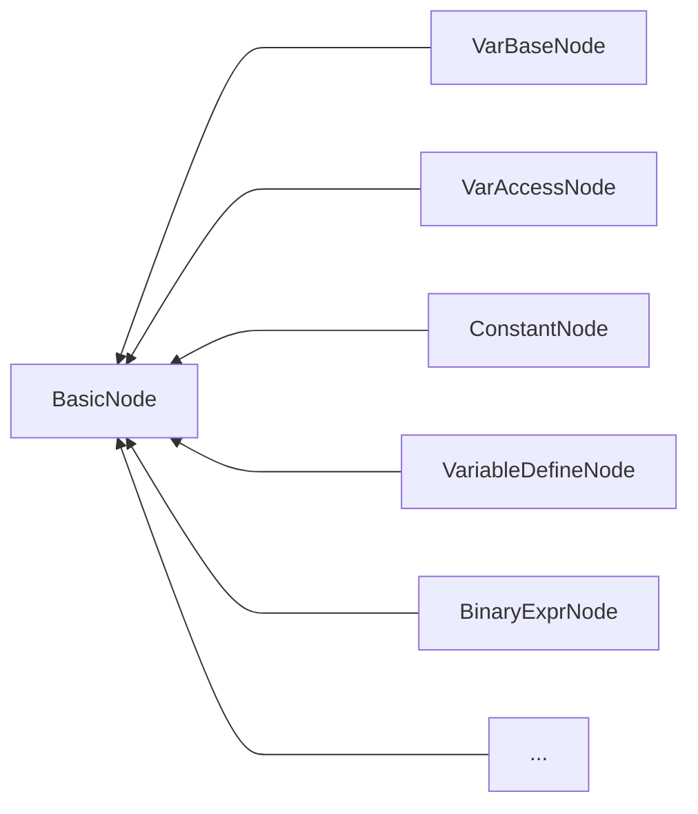
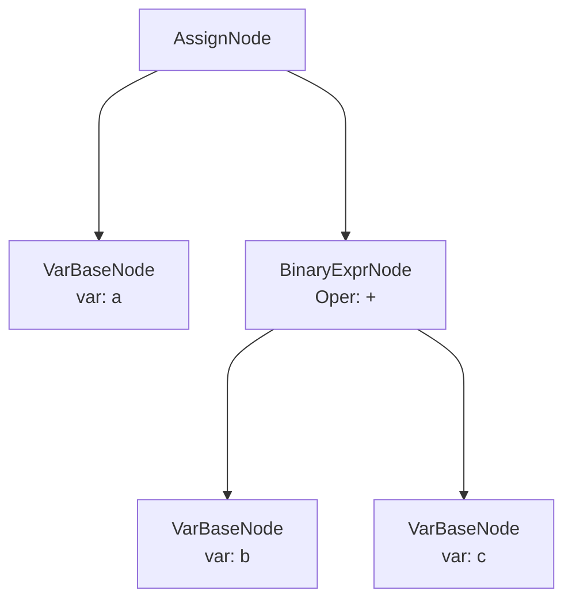
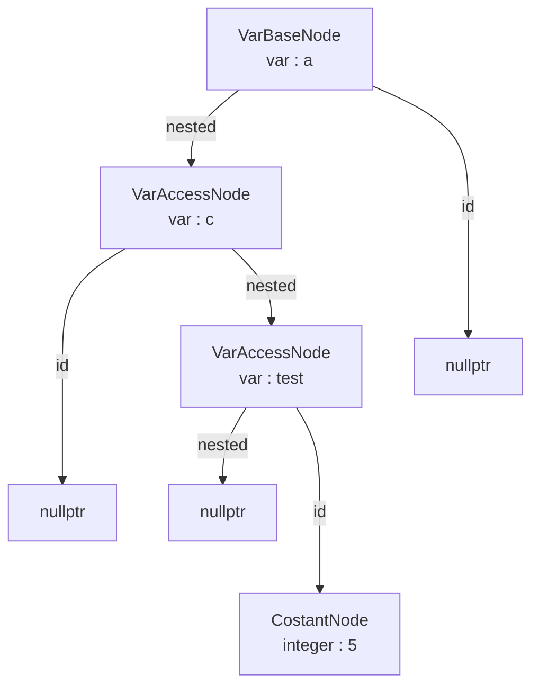
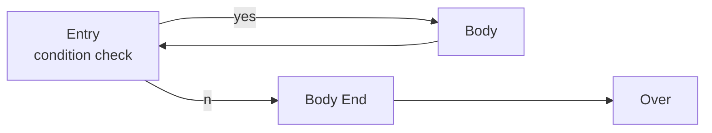
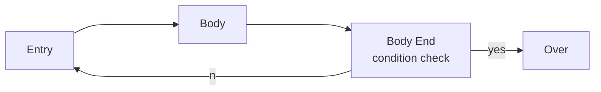
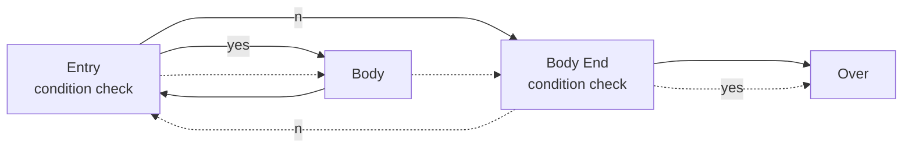
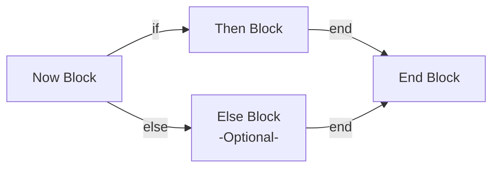

# Report

Jiang Haohan, 3180101995, Computer Science

Wang Xulong, 3180105260, Computer Science

#### Abstract

In the Compile Principle course, we learn about the Basic method to generate a Compiler.

The final Project is to make a simple compiler of the SPL, which is reduced from the Pascal.

In this project, we use the Flex, Bison and LLVM to get tokens, build the syntax tree and build the IR codes and assembly code respectively.

Our development language is C++. The build environment is Windows Subsystem for Linux.

### 1 Introduction

This project, we use the flex, bison and LLVM to generate the code. LLVM use the IR code to divide the frontend and the backend, so that it's easily for us to construct a new compiler and no need to consider the backend and the target machine, so that it's a convenient tool to complete this project.

We divide the compiler into three parts: Lexical Analysis, Syntax Analysis and Sematic Analysis & Code Generation. In the first parts, we use the flex, which is called "Fast Lexical Analyzer Generator" for token reading. And we use Bison, which is compatible with the YACC, which is also based on the LALR(1) to generate the syntax tree. In the last part, we use the LLVM to generate the IR code to the assembly code and executing program.

### 2 Lexical Analysis

### 3 Syntax Analysis

### 4 Semantic Analysis & Code Generation

In this section, I'm going to introduce the Sematic Analysis, which includes the symbol table and the type check. At the same time, we also generate the IR code. In this part, we need to maintain some symbol tables so that make sure that there is no wrong in the code.

#### 4.1 Symbol Table

When it comes to symbol tables, we take the record, variable into consideration.

##### 4.1.1 Record Type Table

For the record, we need to note down the name of the record, and we can use the name of the record as a new variable type conveniently. We use the data structure below to maintain the information of all the record.

```c++
std::map<Type*, std::vector<Type*> > record_type_list;// StructType -> Member_Type_List
std::map<Type*, std::vector<std::string> > record_member_name_list;// StructType -> Member_Name_List
std::map<Type*, std::vector<bool> > record_member_array;// StructType -> Member_Name_List
```

We use the pointer to Type as the index to get the information of the record. use this pointer, we can get the member list of the record easily, and know whether the member is array or not. What's more, we can get the type list. As a result, when we meet a record type, we can recursively access it's member.

Surely, there is a condition that record type which is nested exists. To deal with this, we build others to maintain the information.

```c++
std::map<std::string, Type*> type_map;// TypeName -> Type Pointer
std::map<Type*, std::string> name_map;// Type -> TypeName Pointer
```

we can use the type name, which is shown as a string, to search the type pointer. After that, we can access the details of the record through the type pointer. To make the logic same as the native type, at the beginning of the program, I insert the native information to the table.

```c++
type_map["char"] = ByteType;
name_map[ByteType] = "char";
zero_initial[ByteType] = ConstantInt::get(ByteType, 0);
type_map["integer"] = IntType;
name_map[IntType] = "integer";
zero_initial[IntType] = ConstantInt::get(IntType, 0);
type_map["real"] = RealType;
name_map[RealType] = "real";
zero_initial[RealType] = ConstantFP::get(RealType, 0);
type_map["bool"] = BoolType;
name_map[BoolType] = "bool";
zero_initial[BoolType] = ConstantInt::get(BoolType, 0);
type_map["void"] = VoidType;
name_map[VoidType] = "void";
```

So that, we can use the record as the native type, which means it can deal with the nest type conveniently. The same logic make the access much more easily.

##### 4.1.2 Variable Table

After discussing the record type, we are going to discuss about the design of the variable table. As we discuss above, we treat the record type as one of the type which is similar to native type. there is no need to consider the record anymore. What we only need to pay attention to is the local variable and global variable.

We use the new data structure to maintain the information of the different level's variable.

```c++
int stage;
std::map<std::string, Value*> table_mem[MAX_NESTED];// VarName -> Memory
std::map<std::string, Type*> table_type[MAX_NESTED];// VarName -> Type
std::map<std::string, bool> table_array[MAX_NESTED];// VarName -> Array
```

In these vectors, I store the links of the variable's name and the memory pointer, and the type, whether is array or not. Each time, when we need the information, we can use the map directly and get the information. I use the index of the vector array to show the region of the variable. If the index is 0, it involve the global variable. When the index is bigger than 0, it means the local variable.

When we enter a region which may have the local variables, we need to increase the value of the stage, so that, we can create a new table for the local variables. And we don't check the re-definition of the variable which is at different level, but access the low level variables. 

When we access the variable, we need to check the set level by level from stage down to 0(global variable table). After that, if we can't find the variable, it throws a error at the semantic analysis.

#### 4.2 Type Check & Cast

During the program executing, we may meet the condition that operators are different types. To deal with that, we need to take care of the type of the operators, and sometimes it not easy for Intermediate Language(IR) because we can't calculating with two different-type-operators. There are two main issues: type check whether it can execute, if not give the wrong message, and type cast, if it can execute but need an explicit or implicit casting.

##### 4.2.1 Type check

First, let's take the type check into consideration. The four type we need to deal with has a obvious relationship that real > integer > char > bool. As a result, we use this rules as the basic rules when we do the type check.

when it comes to and/or, the only right condition is that both sides are bool type.

```c++
if (now_op == AND || now_op == OR){
        if ( (!check_bool(lv->getType())) || (!check_bool(rv->getType())) )
            throw new IRBuilderMeesage("[IRBuilder] Error : AND/OR's Bboth Sides Should be Bool Type");
}
```

When it comes to div/mod, which is only applied to the integer, we also need to check the both type, if there is a contradiction.

```c++
lcm_type = get_lcm_type(lv->getType(), rv->getType());
if (lcm_type == RealType && (now_op==DIV||now_op==MOD) ){
    throw new IRBuilderMeesage("[IRBuilder] Error : DIV/MOS's Bboth Sides Shouldn't be Real Type");
}
```

In the code blocks above, the variable `lcm_type` shows the type which can express the both types without trunk but extension.

If we calculate the binary expression with bool or char, we need to change it to the integer to calculate.

```c++
if (lcm_type == BoolType || lcm_type == CharType){
    lcm_type = IntType;
}
```

After the check, we need to convert it to the aim type and do the calculation, which we are going to discuss below.

##### 4.2.2 Type Cast

when we talk about the type cast. It's need a lot of patience. We regard the bool, char as unsigned type, but integer, real as signed type. So we use the signed extend, unsigned extend correspondingly.

```c++
Value* type_cast(Value* v, Type* dt){
    Type* vt = v->getType();
    if (vt == dt){
        return v;
    } else {
        if (dt == RealType){
            if (vt==BoolType || vt == CharType){
                return builder.CreateUIToFP(v, RealType);
            } else { // IntType -> RealType
                return builder.CreateSIToFP(v, RealType);
            }
        } else if (dt == IntType){
            return builder.CreateZExt(v, IntType);
        } else if (dt == CharType){
            return builder.CreateZExt(v, IntType);
        } else {
            throw new IRBuilderMeesage("[IRBuilder] Error : Type Wrong");
        }
    }
    throw new IRBuilderMeesage("[IRBuilder] Error : Type Wrong");
}
```

When we need to convert the the bool and char, we need use unsigned extension. When it comes to integer, we need signed convert.

However, in the assign operation, we need to cast the type to the aim type as before. however, this time, we need to deal with the trunk and extend two conditions.

```c++
Value* assign_cast(Value* v, Type* dt){
    Type* vt = v->getType();
    if (vt == dt) return v;
    if (dt == BoolType){
        if (vt == RealType){
            throw new IRBuilderMeesage("[IRBuilder] Error : Type Wrong");
        } else if (vt == IntType){
            return builder.CreateICmpNE(v, ConstantInt::get(IntType, 0));
        } else if (vt == CharType){
            return builder.CreateICmpNE(v, ConstantInt::get(CharType, 0));
        } else throw new IRBuilderMeesage("[IRBuilder] Error : Type Wrong");
    } ...
}
```

When we are converting to the bool type, we use comparison with zero, and trunk and extension when faced other types.

#### 4.3 IR Code for LLVM

In the IR code generation, we use the LLVM backend to generate the target assembly code. so that we need to transform the abstract AST to IR code for LLVM .

LLVM IR Code is a great design for the compiler. what we need to pay attention to is the calculation. We can use the virtual register without the limit and the backend will optimize the IR code to improve the performance.

```assembly
; ModuleID = 'test'
source_filename = "test"
target datalayout = "e-m:e-p270:32:32-p271:32:32-p272:64:64-i64:64-f80:128-n8:16:32:64-S128"
target triple = "x86_64-pc-linux-gnu"

@0 = private unnamed_addr constant [13 x i8] c"%hd%hd%*[^\0A]\00", align 1
@1 = private unnamed_addr constant [5 x i8] c"%hd\0A\00", align 1

declare i32 @printf(i8*, ...)

declare i32 @scanf(i8*, ...)

define i16 @main() {
  %main = alloca i16
  %a = alloca [3 x i16]
  %1 = getelementptr [3 x i16], [3 x i16]* %a, i64 0, i16 0
  %2 = getelementptr [3 x i16], [3 x i16]* %a, i64 0, i16 1
  %3 = call i32 (i8*, ...) @scanf(i8* getelementptr inbounds ([13 x i8], [13 x i8]* @0, i64 0, i64 0), i16* %1, i16* %2)
  %4 = getelementptr [3 x i16], [3 x i16]* %a, i64 0, i16 0
  %5 = getelementptr [3 x i16], [3 x i16]* %a, i64 0, i16 1
  %6 = load i16, i16* %4
  %7 = load i16, i16* %5
  %8 = add i16 %6, %7
  %9 = getelementptr [3 x i16], [3 x i16]* %a, i64 0, i16 2
  store i16 %8, i16* %9
  %10 = getelementptr [3 x i16], [3 x i16]* %a, i64 0, i16 2
  %11 = load i16, i16* %10
  %12 = call i32 (i8*, ...) @printf(i8* getelementptr inbounds ([5 x i8], [5 x i8]* @1, i64 0, i64 0), i16 %11)
  ret i16 0
}
```

<center>an a+b program's IR code</center>

In this IR code, we can use the `%x` for the virtual registers for no limit, and without the consideration of the target machine. we can use the `lli` to execute or use `clang++` to compile to a executing file.

To use the LLVM backend, we need to use the library of the LLVM to build the code.

#### 4.4 Abstract AST to LLVM IR Code

We use the abstract AST to generate. We use some type of the class which is inherited from the basic type to represent the operation of the program.

All of the nodes on the tree are inherited from the basic class like this.

```c++
class BasicNode{
    public:
    virtual ~BasicNode() = default;
    virtual CodeGenResult* code_gen() = 0;
};
```

In which the `CodeGenResult` type bring the information back to the up level of the AST.

```c++
class CodeGenResult{
    private:
    Value* value;
    public:
    Value* mem;
    Type* type;

    CodeGenResult(Value* _mem, Type* _type, Value* _value){
        mem = _mem;
        type = _type;
        value = _value;
    }
    Value* get_value(){
        if (value == nullptr){
            if (mem == nullptr){
                module->print(outs(), nullptr);
                throw("Error : No Value And Mem for Variable, It's Unpossible\n");
            } else {
                if (type == nullptr){
                    throw("Error : No type for Variable");
                } else {
                    value = builder.CreateLoad(type, mem);
                }
            }
        }
        return value;
    }
    ~CodeGenResult();
};
```

In this class, we use the type to store the type of the variable, and value for value, mem for memory location, obviously.

How ever, we have a lot of type. The class inheritance relationship is below.



Use the feature of the virtual function and inheritance, we can build the IR code easily and build the program easily. All we need is to invoke the function `code_gen()` by the certain order.

Below is a `a=b+c` sample for the AST Tree.



As a result, we invoke the `code_gen()` in a post order for this tree can build the IR Code. However, when we meet other nodes, we may need to change the order to fit the logic.

#### 4.5 IR Code Generate

In this chapter, we are going to discuss about the some special node in the AST Tree, we ignored the obvious node.

##### 4.5.1 Var Access

In common case, we access the basic type, we only need to get the location and load the value to the virtual register can work.

However, there may have some record type and record nested in the record. And the index of the array may also is a variable, we need a good method the access in such condition.

We use the nested method for such access. For the program below.

```pascal
type
    nestrec=record
    a : integer;
    b : integer;
end;
type
	rec=record
	c : nestrec;
	d : nestrec;
end;
var
test : array[1..10] of rec;
```

If we want to access the `test[5].c.a` , the AST is below



We can calculate the index of the array first, and access the `test`. After that, we access the `c` and `a`, which don't have a index. when we go back the `VarBaseNode` again, we can get the sequence `0,5,0,0`, which is used in the `Builder.CreateGEP()`, we can access the memory location of the `test[5].c.a`.

If the index is calculated by the Expression, we can also modify the AST and it can also get the right answer. Although there may have some details, but doesn't matter, the most important thing has been solved. Due to this solution, we can use the `store` to change the variable and `load` for read.

##### 4.5.2 Loop Statement

For the loop Statement, we divide the loop as such blocks

For the **While** Loop



For the **Repeat** Loop



When we use such graph for the loop statement. We can discover that the loop has some similarity.

So we use such graph to build the loop statements, so that we only need one node to deal with all the loop.



For the solid line and dotted line, we use a variable`is_start` to show. for the while and repeat, we use the `reverse` to show if the condition is established, then go to the loop or not. So that, we can deal with all the loop well.

```c++
ASTNodes::CodeGenResult* ASTNodes::RepeatNode::code_gen(){
    Function* func = module->getFunction(now_function);
    BasicBlock* rep_ent = BasicBlock::Create(context, "rep_ent", func);
    BasicBlock* rep_body = BasicBlock::Create(context, "rep_body", func);
    BasicBlock* rep_body_end = BasicBlock::Create(context, "rep_body_end", func);
    BasicBlock* rep_over = BasicBlock::Create(context, "rep_over", func);
    builder.CreateBr(rep_ent);
    builder.SetInsertPoint(rep_ent);

    if (this->is_start){
        if (!reverse){
            builder.CreateCondBr(this->rep_con->code_gen()->get_value(), rep_body, rep_body_end);
        } else {
            builder.CreateCondBr(this->rep_con->code_gen()->get_value(), rep_body_end, rep_body);
        }
        
    } else builder.CreateBr(rep_body);

    builder.SetInsertPoint(rep_body);
    this->rep_body_node->code_gen();

    if (!(this->is_start)){
        if (!reverse){
            builder.CreateCondBr(this->rep_con->code_gen()->get_value(), rep_body, rep_body_end);
        } else {
            builder.CreateCondBr(this->rep_con->code_gen()->get_value(), rep_body_end, rep_body);
        }
    } else builder.CreateBr(rep_ent);

    builder.SetInsertPoint(rep_body_end);
    builder.CreateBr(rep_over);
    builder.SetInsertPoint(rep_over);
    return nullptr;
}
```


##### 4.5.3 If Statement

When we meet the if-else statement. we need new code blocks to solve this.



In the now block, we check the condition, then jump to the then or else block for the answer of the comparison. In the end of the then block and the else block, we jump to end block and end the if-else statement.


```c++
ASTNodes::CodeGenResult* ASTNodes::IfElseNode::code_gen(){
    Function* func = module->getFunction(now_function);
    if (this->else_body == nullptr){
        BasicBlock * then_block = BasicBlock::Create(context, "then_block", func);
        BasicBlock * end_block  = BasicBlock::Create(context, "end_block" , func);
        builder.CreateCondBr(this->cond->code_gen()->get_value(), then_block, end_block);

        builder.SetInsertPoint(then_block);
        this->then_body->code_gen();
        builder.CreateBr(end_block);

        builder.SetInsertPoint(end_block);
        return nullptr;
    } else {
        BasicBlock * then_block = BasicBlock::Create(context, "then_block", func);
        BasicBlock * else_block = BasicBlock::Create(context, "else_block", func);
        BasicBlock * end_block  = BasicBlock::Create(context, "end_block" , func);
        builder.CreateCondBr(this->cond->code_gen()->get_value(), then_block, else_block);
        
        builder.SetInsertPoint(then_block);
        this->then_body->code_gen();
        builder.CreateBr(end_block);

        builder.SetInsertPoint(else_block);
        this->else_body->code_gen();
        builder.CreateBr(end_block);

        builder.SetInsertPoint(end_block);
        return nullptr;
    }
}
```

##### 4.5.4 System Function

We need to make sure the program can read and write. Due to the clang, we can use the library of the c. We use the `printf` and `scanf`.

we need to generate the format string and build it in the function as a global constant variable to use in the function call.

```c++
ASTNodes::CodeGenResult* ASTNodes::SysReadNode::code_gen(){
    std::string _string="";
    std::vector<CodeGenResult*> code_gen_args;
    std::vector<Value*> scanf_args;
    scanf_args.push_back(nullptr);
    code_gen_args.push_back(nullptr);
    for (auto arg: this->args){
        ASTNodes::CodeGenResult* temp=arg->code_gen();
        code_gen_args.push_back(temp);
        if (temp->type == IntType){
            _string += "%hd";
            scanf_args.push_back(temp->mem);
        } else if (temp->type == CharType){
            _string += "%c";
            scanf_args.push_back(temp->mem);
        } else if (temp->type == RealType){
            _string += "%f";
            scanf_args.push_back(temp->mem);
        } else if (temp->type == BoolType){ // Special for Bool Type
            _string += "%d";
            AllocaInst* _int_space = builder.CreateAlloca(Int64Type, nullptr, "temp");
            auto _var_int = builder.CreateGEP(_int_space, builder.getInt64(0));
            scanf_args.push_back(_var_int);
        } else {
            throw new IRBuilderMeesage("[IRBuilder] Error : Wrong Type In Read(ln)");
        }
    }
    if (this->has_newline){
        _string += "%*[^\n]";
    }
    GlobalVariable* format_string = builder.CreateGlobalString(_string);
    Value* format= builder.CreateGEP(format_string, {builder.getInt64(0), builder.getInt64(0)});
    Function* scanf_function=module->getFunction("scanf");
    scanf_args[0] = format;
    ArrayRef <Value*> scanf_ref(scanf_args);
    auto scanf_res = builder.CreateCall(scanf_function, scanf_ref);

    for (int i=1; i<code_gen_args.size(); ++i){ // Get the Result to Bool Type
        if (code_gen_args[i]->type == BoolType){
            Value* read_int = builder.CreateLoad(Int64Type, scanf_args[i]);
            Value* cmp_res = builder.CreateICmpNE(read_int, ConstantInt::get(Int64Type, 0));
            builder.CreateStore(cmp_res, code_gen_args[i]->mem);
        }
    }

    CodeGenResult* ret = new CodeGenResult(nullptr, nullptr, scanf_res);

    return ret;
}
```

### 5 Samples

### 6 Summary